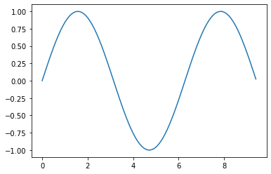
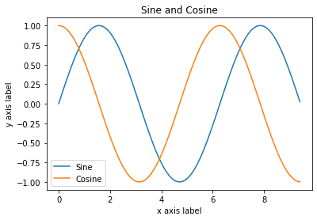
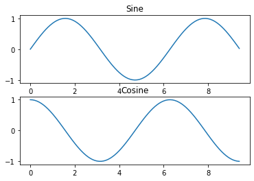

## Matplotlib

Matplotlib is a plotting library. In this section give a brief introduction to the `matplotlib.pyplot` module, which provides a plotting system similar to that of MATLAB.


```python
import matplotlib.pyplot as plt
```

By running this special iPython command, we will be displaying plots inline:


```python
%matplotlib inline
```

### Plotting

The most important function in `matplotlib` is plot, which allows you to plot 2D data. Here is a simple example:


```python
# Compute the x and y coordinates for points on a sine curve
x = np.arange(0, 3 * np.pi, 0.1)
y = np.sin(x)

# Plot the points using matplotlib
plt.plot(x, y)
```


    [<matplotlib.lines.Line2D at 0x1142b94d0>]


    

    


With just a little bit of extra work we can easily plot multiple lines at once, and add a title, legend, and axis labels:


```python
y_sin = np.sin(x)
y_cos = np.cos(x)

# Plot the points using matplotlib
plt.plot(x, y_sin)
plt.plot(x, y_cos)
plt.xlabel('x axis label')
plt.ylabel('y axis label')
plt.title('Sine and Cosine')
plt.legend(['Sine', 'Cosine'])
```


    <matplotlib.legend.Legend at 0x114390a50>


    

    


### Subplots 

You can plot different things in the same figure using the subplot function. Here is an example:


```python
# Compute the x and y coordinates for points on sine and cosine curves
x = np.arange(0, 3 * np.pi, 0.1)
y_sin = np.sin(x)
y_cos = np.cos(x)

# Set up a subplot grid that has height 2 and width 1,
# and set the first such subplot as active.
plt.subplot(2, 1, 1)

# Make the first plot
plt.plot(x, y_sin)
plt.title('Sine')

# Set the second subplot as active, and make the second plot.
plt.subplot(2, 1, 2)
plt.plot(x, y_cos)
plt.title('Cosine')

# Show the figure.
plt.show()
```


    

    


You can read much more about the `subplot` function in the [documentation](http://matplotlib.org/api/pyplot_api.html#matplotlib.pyplot.subplot).