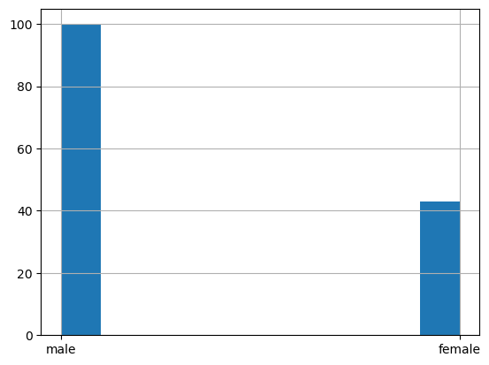

# NumPy

[numpy.org/doc/](https://numpy.org/doc/stable/)

Библеотека NumPy предоставляет следующие **возможности**: 
* работать с многомерными массивами (включая матрицы)
* производить быстрое вычисление математических функций на многомерных массивах

Ядром пакета NumPy является объект [ndarray](https://docs.scipy.org/doc/numpy/reference/generated/numpy.ndarray.html)

**Важные отличия** между NumPy arrays и Python sequences: 
* NumPy array имеет фиксированную длину, которая определяется в момент его создания (в отличие от Python lists, которые могут расти динамически)
* Элементы в NumPy array должны быть одного типа
* Можно выполнять операции непосредственно над NumPy arrays

**Сильные стороны** NumPy: 
* Vectorization 
* Broadcasting

**Мотивирующий пример**


```python
import numpy as np
```

## Способы создания Numpy arrays
* Конвертация из Python structures
* Генерация с помощью встроенных функций
* Чтение с диска


### Конвертация из Python structures


```python
np.array([1, 2, 3, 4, 5])
```


    array([1, 2, 3, 4, 5])


При конвертации можно задавать тип данных с помощью аргумента [dtype](https://docs.scipy.org/doc/numpy/reference/generated/numpy.dtype.html): 


```python
np.array([1, 2, 3, 4, 5], dtype=np.float32)
```


    array([1., 2., 3., 4., 5.], dtype=float32)


Аналогичное преобразование:


```python
np.float32([1, 2, 3, 4, 5])
```


    array([1., 2., 3., 4., 5.], dtype=float32)


### Генерация Numpy arrays

* [arange](https://docs.scipy.org/doc/numpy/reference/generated/numpy.arange.html) — аналог range из Python, которому можно передать нецелочисленный шаг
* [linspace](https://docs.scipy.org/doc/numpy/reference/generated/numpy.linspace.html) — способ равномерно разбить отрезок на n-1 интервал
* [logspace](https://docs.scipy.org/doc/numpy/reference/generated/numpy.logspace.html) — способ разбить отрезок по логарифмической шкале
* [zeros](https://docs.scipy.org/doc/numpy/reference/generated/numpy.zeros.html) — создаёт массив заполненный нулями заданной размерности
* [ones](https://docs.scipy.org/doc/numpy/reference/generated/numpy.ones.html) — создаёт массив заполненный единицами заданной размерности
* [empty](https://docs.scipy.org/doc/numpy/reference/generated/numpy.empty.html) — создаёт массив неинициализированный никаким значением заданной размерности


```python
np.arange(0, 5, 0.5)
```


    array([0. , 0.5, 1. , 1.5, 2. , 2.5, 3. , 3.5, 4. , 4.5])


```python
np.linspace(0, 5, 11)
```


    array([0. , 0.5, 1. , 1.5, 2. , 2.5, 3. , 3.5, 4. , 4.5, 5. ])


```python
np.logspace(0, 9, 10, base=2)
```


    array([  1.,   2.,   4.,   8.,  16.,  32.,  64., 128., 256., 512.])


```python
np.zeros((2, 2))
```


    array([[0., 0.],
           [0., 0.]])


```python
np.ones((2, 2))
```


    array([[1., 1.],
           [1., 1.]])


```python
np.empty((2, 2))
```


    array([[1., 1.],
           [1., 1.]])


```python
np.diag([1,2,3])
```


    array([[1, 0, 0],
           [0, 2, 0],
           [0, 0, 3]])


Pазмеры массива храниться в поле **shape**, а количество размерностей - в **ndim**


```python
array = np.ones((2, 3,))
print('Размерность массива - %s, количество размерностей - %d'%(array.shape, array.ndim))
array
```

    Размерность массива - (2, 3), количество размерностей - 2


    array([[1., 1., 1.],
           [1., 1., 1.]])


```python
## Чему равень ndim и shape в следующих случаях
print(np.diag([1,2,3]).shape, np.diag([1,2,3]).ndim)
print(np.zeros((5, 5, 5)).shape, np.zeros((5, 5, 5)).ndim)
```

    (3, 3) 2
    (5, 5, 5) 3


Метод [reshape](https://docs.scipy.org/doc/numpy/reference/generated/numpy.reshape.html) позволяет преобразовать размеры массива без изменения данных


```python
array = np.arange(0, 6, 0.5)
array = array.reshape((2, 6))
array
```


    array([[0. , 0.5, 1. , 1.5, 2. , 2.5],
           [3. , 3.5, 4. , 4.5, 5. , 5.5]])


Для того что бы развернуть многомерный массив в вектор, можно воспользоваться функцией [ravel](ravel)


```python
array = np.ravel(array)
array
```


    array([0. , 0.5, 1. , 1.5, 2. , 2.5, 3. , 3.5, 4. , 4.5, 5. , 5.5])


```python
# Какие будут массивы?
print(np.ravel(np.diag([1,2])))
print(np.reshape(np.diag([1,2]), [1, 4]))
```

    [1 0 0 2]
    [[1 0 0 2]]


## Индексация

В NumPy работает привычная индексация Python, включая использование отрицательных индексов и срезов


```python
print(array[0])
print(array[-1])
print(array[1:-1])
print(array[1:-1:2])
print(array[::-1])
```

    0.0
    5.5
    [0.5 1.  1.5 2.  2.5 3.  3.5 4.  4.5 5. ]
    [0.5 1.5 2.5 3.5 4.5]
    [5.5 5.  4.5 4.  3.5 3.  2.5 2.  1.5 1.  0.5 0. ]


```python
print(array.shape)
```

    (12,)


```python
print(array[None,0:, None].ndim, array[None,0:, None].shape)
array[None,0:, None]
```

    3 (1, 12, 1)


    array([[[0. ],
            [0.5],
            [1. ],
            [1.5],
            [2. ],
            [2.5],
            [3. ],
            [3.5],
            [4. ],
            [4.5],
            [5. ],
            [5.5]]])


**Замечание**: Индексы и срезы в многомерных массивах не нужно разделять квадратными скобками 

т.е. вместо ```matrix[i][j]``` нужно использовать ```matrix[i, j]```

В качестве индексов можно использовать массивы:


```python
array[[0, 2, 4, 6, 8, 10]]
```


    array([0., 1., 2., 3., 4., 5.])


```python
array[[True, False, True, False, True, False, True, False, True, False, True, False]]
```


    array([0., 1., 2., 3., 4., 5.])


```python
# Что будет выведено?
x = np.array([[1, 2, 3]])
y = np.array([1, 2, 3])

print (x.shape, y.shape)

print(np.array_equal(x, y))
print(np.array_equal(x, y[None, :]))
```

    (1, 3) (3,)
    False
    True


```python
x = np.arange(10)
x
```


    array([0, 1, 2, 3, 4, 5, 6, 7, 8, 9])


```python
x[(x % 2 == 0) & (x > 5)]
```


    array([6, 8])


```python
print(x)
y = x[x>5] 
y *= 2
print(y)
print(x)
```

    [0 1 2 3 4 5 6 7 8 9]
    [12 14 16 18]
    [0 1 2 3 4 5 6 7 8 9]


Для копирования в numpy есть метод copy


```python
x.copy()
```


    array([0, 1, 2, 3, 4, 5, 6, 7, 8, 9])


### Чтение данных с помощью функции [genfromtxt](https://docs.scipy.org/doc/numpy/reference/generated/numpy.genfromtxt.html#numpy.genfromtxt)


```python
with open('out.npz', 'wb') as f:
    np.save(f, x)
    
with open('out.npz', 'rb') as f:
    print(f.read())
    
with open('out.npz', 'rb') as f:
    y = np.load(f)
    print(y)    
```

    b"\x93NUMPY\x01\x00v\x00{'descr': '<i8', 'fortran_order': False, 'shape': (10,), }                                                           \n\x00\x00\x00\x00\x00\x00\x00\x00\x01\x00\x00\x00\x00\x00\x00\x00\x02\x00\x00\x00\x00\x00\x00\x00\x03\x00\x00\x00\x00\x00\x00\x00\x04\x00\x00\x00\x00\x00\x00\x00\x05\x00\x00\x00\x00\x00\x00\x00\x06\x00\x00\x00\x00\x00\x00\x00\x07\x00\x00\x00\x00\x00\x00\x00\x08\x00\x00\x00\x00\x00\x00\x00\t\x00\x00\x00\x00\x00\x00\x00"
    [0 1 2 3 4 5 6 7 8 9]


```python
iris = np.genfromtxt('iris_subset.txt', delimiter=', ', names=True, dtype=[('sepal_length_in_cm', 'f8'), 
                                                                          ('sepal_width_in_cm', 'f8'), 
                                                                          ('petal_length_in_cm', 'f8'), 
                                                                          ('petal_width_in_cm', 'f8'),
                                                                          ('class', 'U10')])
iris
```


    array([(1.000e+00,   1. ,   10.,   121. , 'setosa'),
           (1.000e+00, 314. ,   13.,   121. , 'versicolor'),
           (1.134e+03,   1. ,  103.,  1421. , 'setosa'),
           (1.000e+00, 141. ,   10.,   121. , 'versicolor'),
           (1.440e+02,   1. , 4582., 13481. , 'versicolor'),
           (1.000e+00,  13.3,   10.,   121. , 'versicolor'),
           (1.141e+03,   1. , 1341.,  1231.1, 'setosa'),
           (7.320e+02, 131. ,  139.,    92.1, 'setosa')],
          dtype=[('sepal_length_in_cm', '<f8'), ('sepal_width_in_cm', '<f8'), ('petal_length_in_cm', '<f8'), ('petal_width_in_cm', '<f8'), ('class', '<U10')])


Значения строки можно запросить по индексу, а значения колонки по её названию


```python
print('Описание первого элемента: %s'%iris[0])
print('Значения столбца sepal_length_in_cm: %s'%iris['sepal_length_in_cm'])
```

    Описание первого элемента: (1., 1., 10., 121., 'setosa')
    Значения столбца sepal_length_in_cm: [1.000e+00 1.000e+00 1.134e+03 1.000e+00 1.440e+02 1.000e+00 1.141e+03
     7.320e+02]


```python
sepal_length_setosa = iris['sepal_length_in_cm'][iris['class'] == 'setosa']
sepal_length_versicolor = iris['sepal_length_in_cm'][iris['class'] == 'versicolor']

print('Значения слтобца sepal_length_in_cm\n\tclass setosa: %s\n\tclass versicolor: %s'%(sepal_length_setosa, 
                                                                                         sepal_length_versicolor))
```

    Значения слтобца sepal_length_in_cm
    	class setosa: [1.000e+00 1.134e+03 1.141e+03 7.320e+02]
    	class versicolor: [  1.   1. 144.   1.]


При чтение данных из файла можно пропускать строки в конце и в начале, используя **skip_header** и **skip_footer**, а также брать только нужные столбцы - **usecols**


```python
iris_class = np.genfromtxt('iris_subset.txt', delimiter=', ', skip_header=1, usecols=4, dtype='U10')
iris_class
```


    array(['setosa', 'versicolor', 'setosa', 'versicolor', 'versicolor',
           'versicolor', 'setosa', 'setosa'], dtype='<U10')


```python
iris_features = np.genfromtxt('iris_subset.txt', delimiter=', ', skip_header=1, usecols=range(4))
iris_features
```


    array([[1.0000e+00, 1.0000e+00, 1.0000e+01, 1.2100e+02],
           [1.0000e+00, 3.1400e+02, 1.3000e+01, 1.2100e+02],
           [1.1340e+03, 1.0000e+00, 1.0300e+02, 1.4210e+03],
           [1.0000e+00, 1.4100e+02, 1.0000e+01, 1.2100e+02],
           [1.4400e+02, 1.0000e+00, 4.5820e+03, 1.3481e+04],
           [1.0000e+00, 1.3300e+01, 1.0000e+01, 1.2100e+02],
           [1.1410e+03, 1.0000e+00, 1.3410e+03, 1.2311e+03],
           [7.3200e+02, 1.3100e+02, 1.3900e+02, 9.2100e+01]])


```python
features_setosa = iris_features[iris_class == 'setosa']
features_versicolor = iris_features[iris_class == 'versicolor']
```

Операции в NumPy можно производить непосредственно над векторами одинаковой размерности без использования циклов

Например, вычисление поэлементной разности между векторами выглядит следующим образом:


```python
sepal_length_versicolor - sepal_length_setosa
```


    array([    0., -1133.,  -997.,  -731.])


Аналогчино для многомерных массивов


```python
features_versicolor - features_setosa
```


    array([[ 0.00000e+00,  3.13000e+02,  3.00000e+00,  0.00000e+00],
           [-1.13300e+03,  1.40000e+02, -9.30000e+01, -1.30000e+03],
           [-9.97000e+02,  0.00000e+00,  3.24100e+03,  1.22499e+04],
           [-7.31000e+02, -1.17700e+02, -1.29000e+02,  2.89000e+01]])


## [Broadcasting](https://docs.scipy.org/doc/numpy/user/basics.broadcasting.html)

Broadcasting снимает правило одной размерности и позволяет производить арифметические операции над массивами разных, но всё-таки созгласованных размерностей. Простейшим примером является умножение вектора на число:


```python
2*np.arange(1, 4)
```


    array([2, 4, 6])


Правило согласования размерностей выражается в одном предложение: 

```In order to broadcast, the size of the trailing axes for both arrays in an operation must either be the same size or one of them must be one```

Если количество размерностей не совпадают, то к массиву меньшей размерности добавляются фиктивные размерности "слева", например:
```
a  = np.ones((2,3,4))
b = np.ones(4)
c = a * b # here a.shape=(2,3,4) and b.shape is considered to be (1,1,4)
```

Прибавим к каждой строчки матрицы один и тот же вектор:


```python
np.array([[0, 0, 0], [10, 10, 10], [20, 20, 20], [30, 30, 30]]) + np.arange(3)
```


    array([[ 0,  1,  2],
           [10, 11, 12],
           [20, 21, 22],
           [30, 31, 32]])


Теперь если мы хотим, проделать тот же трюк но со столбцами, то мы не можем просто добавить вектор состоящий из 4 элементов т.к. в данном случае размеры будут не согласованы


Сначала нужно преоброзовать вектор к виду:


```python
np.arange(4)[:, np.newaxis]
```


    array([[0],
           [1],
           [2],
           [3]])


А затем к нему добавить матрицу:


```python
np.arange(4)[:, np.newaxis]+np.array([[0, 0, 0], [10, 10, 10], [20, 20, 20], [30, 30, 30]])
```


    array([[ 0,  0,  0],
           [11, 11, 11],
           [22, 22, 22],
           [33, 33, 33]])


Так же в NumPy реализованно много полезных операций для работы с массивами: [np.min](https://docs.scipy.org/doc/numpy/reference/generated/numpy.ndarray.min.html), [np.max](https://docs.scipy.org/doc/numpy/reference/generated/numpy.ndarray.max.html), [np.sum](https://docs.scipy.org/doc/numpy/reference/generated/numpy.sum.html), [np.mean](https://docs.scipy.org/doc/numpy/reference/generated/numpy.mean.html) и т.д.


```python
print('Среднее значение всех значений класса versicolor: %s'%np.mean(features_versicolor))
print('Среднее значение каждого признака класса versicolor: %s'%np.mean(features_versicolor, axis=1))
```

    Среднее значение всех значений класса versicolor: 1192.20625
    Среднее значение каждого признака класса versicolor: [ 112.25    68.25  4552.      36.325]


Теперь эффективно посчитаем $\frac{1}{n} \sum\limits_{i=1}^n |x_i-y_i|$ для каждой пары $(x, y)$, где $x$ - вектор признаков объекта из класса setosa, а $y$ - вектор признаков объекта из класса versicolor


```python
np.mean(np.abs(features_setosa - features_versicolor[:, np.newaxis]), axis=2)
```


    array([[7.900000e+01, 7.090000e+02, 9.727750e+02, 2.672250e+02],
           [3.500000e+01, 6.665000e+02, 9.302750e+02, 2.247250e+02],
           [4.518750e+03, 4.382250e+03, 4.121975e+03, 4.637475e+03],
           [3.075000e+00, 6.345750e+02, 8.983500e+02, 2.516500e+02]])


### Операции


```python
x = np.arange(40).reshape(5, 2, 4)
print(x)
```

    [[[ 0  1  2  3]
      [ 4  5  6  7]]
    
     [[ 8  9 10 11]
      [12 13 14 15]]
    
     [[16 17 18 19]
      [20 21 22 23]]
    
     [[24 25 26 27]
      [28 29 30 31]]
    
     [[32 33 34 35]
      [36 37 38 39]]]


```python
print(x.mean())
print(np.mean(x))
```

    19.5
    19.5


```python
x.mean(axis=0)
```


    array([[16., 17., 18., 19.],
           [20., 21., 22., 23.]])


```python
x.mean(axis=1)
```


    array([[ 2.,  3.,  4.,  5.],
           [10., 11., 12., 13.],
           [18., 19., 20., 21.],
           [26., 27., 28., 29.],
           [34., 35., 36., 37.]])


```python
x.mean(axis=2)
```


    array([[ 1.5,  5.5],
           [ 9.5, 13.5],
           [17.5, 21.5],
           [25.5, 29.5],
           [33.5, 37.5]])


```python
x.mean(axis=(0,2))
```


    array([17.5, 21.5])


```python
x.mean(axis=(0,1,2))
```


    19.5


### Конкатенация многомерных массивов

Конкатенировать несколько массивом можно с помощью функций **np.concatenate, np.hstack, np.vstack, np.dstack**


```python
x = np.arange(10).reshape(5, 2)
y = np.arange(100, 120).reshape(5, 4)
```


```python
x
```


    array([[0, 1],
           [2, 3],
           [4, 5],
           [6, 7],
           [8, 9]])


```python
y
```


    array([[100, 101, 102, 103],
           [104, 105, 106, 107],
           [108, 109, 110, 111],
           [112, 113, 114, 115],
           [116, 117, 118, 119]])


```python
np.hstack((x, y))
```


    array([[  0,   1, 100, 101, 102, 103],
           [  2,   3, 104, 105, 106, 107],
           [  4,   5, 108, 109, 110, 111],
           [  6,   7, 112, 113, 114, 115],
           [  8,   9, 116, 117, 118, 119]])


```python
x = np.ones([2, 3])
y = np.zeros([2, 2])
```


```python
# Какой будет результат
print(np.hstack((x,y)).shape)
print(np.vstack((x,y)).shape)
```

    (2, 5)


    ---------------------------------------------------------------------------

    ValueError                                Traceback (most recent call last)

    Cell In[54], line 3
          1 # Какой будет результат
          2 print(np.hstack((x,y)).shape)
    ----> 3 print(np.vstack((x,y)).shape)


    File /opt/anaconda3/lib/python3.12/site-packages/numpy/core/shape_base.py:289, in vstack(tup, dtype, casting)
        287 if not isinstance(arrs, list):
        288     arrs = [arrs]
    --> 289 return _nx.concatenate(arrs, 0, dtype=dtype, casting=casting)


    ValueError: all the input array dimensions except for the concatenation axis must match exactly, but along dimension 1, the array at index 0 has size 3 and the array at index 1 has size 2


```python
p = np.arange(1).reshape([1, 1, 1, 1])
p
```


    array([[[[0]]]])


```python
print("vstack: ", np.vstack((p, p)).shape)
print("hstack: ", np.hstack((p, p)).shape)
print("dstack: ", np.dstack((p, p)).shape)
print("concatenate: ", np.concatenate((p, p), axis=3).shape)
```

    vstack:  (2, 1, 1, 1)
    hstack:  (1, 2, 1, 1)
    dstack:  (1, 1, 2, 1)
    concatenate:  (1, 1, 1, 2)


### Типы


```python
x = [1, 2, 70000]
```


```python
np.array(x, dtype=np.float32)
```


    array([1.e+00, 2.e+00, 7.e+04], dtype=float32)


```python
np.array(x, dtype=np.uint16)
```

    /tmp/ipykernel_984447/2771282312.py:1: DeprecationWarning: NumPy will stop allowing conversion of out-of-bound Python integers to integer arrays.  The conversion of 70000 to uint16 will fail in the future.
    For the old behavior, usually:
        np.array(value).astype(dtype)
    will give the desired result (the cast overflows).
      np.array(x, dtype=np.uint16)


    array([   1,    2, 4464], dtype=uint16)


```python
np.array(x, dtype=np.unicode_)
```


    array(['1', '2', '70000'], dtype='<U5')


### Функциональное программирование


```python
def f(value):
    return np.sqrt(value)
```


```python
print(np.apply_along_axis(f, 0, np.arange(10)))
```

    [0.         1.         1.41421356 1.73205081 2.         2.23606798
     2.44948974 2.64575131 2.82842712 3.        ]


```python
vf = np.vectorize(f)
```


```python
%%timeit 
vf(np.arange(100000))
```

    146 ms ± 2.4 ms per loop (mean ± std. dev. of 7 runs, 10 loops each)


```python
%%timeit 
np.apply_along_axis(f, 0, np.arange(100000)) 
```

    1.89 ms ± 31.9 μs per loop (mean ± std. dev. of 7 runs, 1,000 loops each)


```python
%%timeit 
np.array([f(v) for v in np.arange(100000)])
```

    129 ms ± 861 μs per loop (mean ± std. dev. of 7 runs, 10 loops each)


# Pandas

[pandas.pydata.org/docs/](https://pandas.pydata.org/docs/)

Подключаем библиотеку Pandas, предназначенную для считывания, предобработки и быстрой визуализации данных, а также для простой аналитики.


```python
import pandas as pd
df = pd.read_csv("titanic.csv", sep='\t')
```


```python
df.head(3)
```


<div>
<style scoped>
    .dataframe tbody tr th:only-of-type {
        vertical-align: middle;
    }

    .dataframe tbody tr th {
        vertical-align: top;
    }

    .dataframe thead th {
        text-align: right;
    }
</style>
<table border="1" class="dataframe">
  <thead>
    <tr style="text-align: right;">
      <th></th>
      <th>PassengerId</th>
      <th>Survived</th>
      <th>Pclass</th>
      <th>Name</th>
      <th>Sex</th>
      <th>Age</th>
      <th>SibSp</th>
      <th>Parch</th>
      <th>Ticket</th>
      <th>Fare</th>
      <th>Cabin</th>
      <th>Embarked</th>
    </tr>
  </thead>
  <tbody>
    <tr>
      <th>0</th>
      <td>1</td>
      <td>0</td>
      <td>3</td>
      <td>Braund, Mr. Owen Harris</td>
      <td>male</td>
      <td>22.0</td>
      <td>1</td>
      <td>0</td>
      <td>A/5 21171</td>
      <td>7.2500</td>
      <td>NaN</td>
      <td>S</td>
    </tr>
    <tr>
      <th>1</th>
      <td>2</td>
      <td>1</td>
      <td>1</td>
      <td>Cumings, Mrs. John Bradley (Florence Briggs Th...</td>
      <td>female</td>
      <td>38.0</td>
      <td>1</td>
      <td>0</td>
      <td>PC 17599</td>
      <td>71.2833</td>
      <td>C85</td>
      <td>C</td>
    </tr>
    <tr>
      <th>2</th>
      <td>3</td>
      <td>1</td>
      <td>3</td>
      <td>Heikkinen, Miss. Laina</td>
      <td>female</td>
      <td>26.0</td>
      <td>0</td>
      <td>0</td>
      <td>STON/O2. 3101282</td>
      <td>7.9250</td>
      <td>NaN</td>
      <td>S</td>
    </tr>
  </tbody>
</table>
</div>


```python
view = df[df['Sex'] == 'female']
```


```python
list(((df['Sex'] == 'female') & (df['Age'] > 30)).index)
```


    [0,
     1,
     2,
     3,
     4,
     5,
     6,
     7,
     8,
     9,
     10,
     11,
     12,
     13,
     14,
     15,
     16,
     17,
     18,
     19,
     20,
     21,
     22,
     23,
     24,
     25,
     26,
     27,
     28,
     29,
     30,
     31,
     32,
     33,
     34,
     35,
     36,
     37,
     38,
     39,
     40,
     41,
     42,
     43,
     44,
     45,
     46,
     47,
     48,
     49,
     50,
     51,
     52,
     53,
     54,
     55,
     56,
     57,
     58,
     59,
     60,
     61,
     62,
     63,
     64,
     65,
     66,
     67,
     68,
     69,
     70,
     71,
     72,
     73,
     74,
     75,
     76,
     77,
     78,
     79,
     80,
     81,
     82,
     83,
     84,
     85,
     86,
     87,
     88,
     89,
     90,
     91,
     92,
     93,
     94,
     95,
     96,
     97,
     98,
     99,
     100,
     101,
     102,
     103,
     104,
     105,
     106,
     107,
     108,
     109,
     110,
     111,
     112,
     113,
     114,
     115,
     116,
     117,
     118,
     119,
     120,
     121,
     122,
     123,
     124,
     125,
     126,
     127,
     128,
     129,
     130,
     131,
     132,
     133,
     134,
     135,
     136,
     137,
     138,
     139,
     140,
     141,
     142,
     143,
     144,
     145,
     146,
     147,
     148,
     149,
     150,
     151,
     152,
     153,
     154,
     155]


```python
df[(df['Sex'] == 'female') & (df['Age'] > 30)].index
```


    Index([1, 3, 11, 15, 18, 25, 40, 52, 61, 85, 98, 123, 132], dtype='int64')


```python
df.drop(index=(df[(df['Sex'] == 'female') & (df['Age'] > 30)].index),axis=1, inplace=True)
```


```python
df.loc[78]
```


    PassengerId                               79
    Survived                                   1
    Pclass                                     2
    Name           Caldwell, Master. Alden Gates
    Sex                                     male
    Age                                     0.83
    SibSp                                      0
    Parch                                      2
    Ticket                                248738
    Fare                                    29.0
    Cabin                                    NaN
    Embarked                                   S
    Name: 78, dtype: object


```python
df.iloc[0]
```


    PassengerId                          1
    Survived                             0
    Pclass                               3
    Name           Braund, Mr. Owen Harris
    Sex                               male
    Age                               22.0
    SibSp                                1
    Parch                                0
    Ticket                       A/5 21171
    Fare                              7.25
    Cabin                              NaN
    Embarked                             S
    Name: 0, dtype: object


```python
df.describe()
```


<div>
<style scoped>
    .dataframe tbody tr th:only-of-type {
        vertical-align: middle;
    }

    .dataframe tbody tr th {
        vertical-align: top;
    }

    .dataframe thead th {
        text-align: right;
    }
</style>
<table border="1" class="dataframe">
  <thead>
    <tr style="text-align: right;">
      <th></th>
      <th>PassengerId</th>
      <th>Survived</th>
      <th>Pclass</th>
      <th>Age</th>
      <th>SibSp</th>
      <th>Parch</th>
      <th>Fare</th>
    </tr>
  </thead>
  <tbody>
    <tr>
      <th>count</th>
      <td>143.000000</td>
      <td>143.000000</td>
      <td>143.000000</td>
      <td>113.000000</td>
      <td>143.000000</td>
      <td>143.000000</td>
      <td>143.000000</td>
    </tr>
    <tr>
      <th>mean</th>
      <td>80.902098</td>
      <td>0.307692</td>
      <td>2.461538</td>
      <td>26.702035</td>
      <td>0.601399</td>
      <td>0.391608</td>
      <td>27.526018</td>
    </tr>
    <tr>
      <th>std</th>
      <td>44.536473</td>
      <td>0.463161</td>
      <td>0.776134</td>
      <td>14.483237</td>
      <td>1.075593</td>
      <td>0.813919</td>
      <td>40.406013</td>
    </tr>
    <tr>
      <th>min</th>
      <td>1.000000</td>
      <td>0.000000</td>
      <td>1.000000</td>
      <td>0.830000</td>
      <td>0.000000</td>
      <td>0.000000</td>
      <td>6.750000</td>
    </tr>
    <tr>
      <th>25%</th>
      <td>43.500000</td>
      <td>0.000000</td>
      <td>2.000000</td>
      <td>19.000000</td>
      <td>0.000000</td>
      <td>0.000000</td>
      <td>7.925000</td>
    </tr>
    <tr>
      <th>50%</th>
      <td>81.000000</td>
      <td>0.000000</td>
      <td>3.000000</td>
      <td>24.000000</td>
      <td>0.000000</td>
      <td>0.000000</td>
      <td>13.000000</td>
    </tr>
    <tr>
      <th>75%</th>
      <td>118.500000</td>
      <td>1.000000</td>
      <td>3.000000</td>
      <td>33.000000</td>
      <td>1.000000</td>
      <td>0.000000</td>
      <td>29.597900</td>
    </tr>
    <tr>
      <th>max</th>
      <td>156.000000</td>
      <td>1.000000</td>
      <td>3.000000</td>
      <td>71.000000</td>
      <td>5.000000</td>
      <td>5.000000</td>
      <td>263.000000</td>
    </tr>
  </tbody>
</table>
</div>


```python
df[["Sex", "Cabin"]].describe()
```


<div>
<style scoped>
    .dataframe tbody tr th:only-of-type {
        vertical-align: middle;
    }

    .dataframe tbody tr th {
        vertical-align: top;
    }

    .dataframe thead th {
        text-align: right;
    }
</style>
<table border="1" class="dataframe">
  <thead>
    <tr style="text-align: right;">
      <th></th>
      <th>Sex</th>
      <th>Cabin</th>
    </tr>
  </thead>
  <tbody>
    <tr>
      <th>count</th>
      <td>143</td>
      <td>25</td>
    </tr>
    <tr>
      <th>unique</th>
      <td>2</td>
      <td>23</td>
    </tr>
    <tr>
      <th>top</th>
      <td>male</td>
      <td>C23 C25 C27</td>
    </tr>
    <tr>
      <th>freq</th>
      <td>100</td>
      <td>2</td>
    </tr>
  </tbody>
</table>
</div>


### Срезы в DataFrame

### Индексация


```python
df.sort_values("Age", inplace=True)
```


```python
df.head(3)
```


<div>
<style scoped>
    .dataframe tbody tr th:only-of-type {
        vertical-align: middle;
    }

    .dataframe tbody tr th {
        vertical-align: top;
    }

    .dataframe thead th {
        text-align: right;
    }
</style>
<table border="1" class="dataframe">
  <thead>
    <tr style="text-align: right;">
      <th></th>
      <th>PassengerId</th>
      <th>Survived</th>
      <th>Pclass</th>
      <th>Name</th>
      <th>Sex</th>
      <th>Age</th>
      <th>SibSp</th>
      <th>Parch</th>
      <th>Ticket</th>
      <th>Fare</th>
      <th>Cabin</th>
      <th>Embarked</th>
    </tr>
  </thead>
  <tbody>
    <tr>
      <th>78</th>
      <td>79</td>
      <td>1</td>
      <td>2</td>
      <td>Caldwell, Master. Alden Gates</td>
      <td>male</td>
      <td>0.83</td>
      <td>0</td>
      <td>2</td>
      <td>248738</td>
      <td>29.000</td>
      <td>NaN</td>
      <td>S</td>
    </tr>
    <tr>
      <th>7</th>
      <td>8</td>
      <td>0</td>
      <td>3</td>
      <td>Palsson, Master. Gosta Leonard</td>
      <td>male</td>
      <td>2.00</td>
      <td>3</td>
      <td>1</td>
      <td>349909</td>
      <td>21.075</td>
      <td>NaN</td>
      <td>S</td>
    </tr>
    <tr>
      <th>119</th>
      <td>120</td>
      <td>0</td>
      <td>3</td>
      <td>Andersson, Miss. Ellis Anna Maria</td>
      <td>female</td>
      <td>2.00</td>
      <td>4</td>
      <td>2</td>
      <td>347082</td>
      <td>31.275</td>
      <td>NaN</td>
      <td>S</td>
    </tr>
  </tbody>
</table>
</div>


```python
df.iloc[78]
```


    PassengerId                              67
    Survived                                  1
    Pclass                                    2
    Name           Nye, Mrs. (Elizabeth Ramell)
    Sex                                  female
    Age                                    29.0
    SibSp                                     0
    Parch                                     0
    Ticket                           C.A. 29395
    Fare                                   10.5
    Cabin                                   F33
    Embarked                                  S
    Name: 66, dtype: object


```python
df.loc[78]
```


    PassengerId                               79
    Survived                                   1
    Pclass                                     2
    Name           Caldwell, Master. Alden Gates
    Sex                                     male
    Age                                     0.83
    SibSp                                      0
    Parch                                      2
    Ticket                                248738
    Fare                                    29.0
    Cabin                                    NaN
    Embarked                                   S
    Name: 78, dtype: object


```python
df.loc[[78, 79, 100], ["Age", "Cabin"]]
```


<div>
<style scoped>
    .dataframe tbody tr th:only-of-type {
        vertical-align: middle;
    }

    .dataframe tbody tr th {
        vertical-align: top;
    }

    .dataframe thead th {
        text-align: right;
    }
</style>
<table border="1" class="dataframe">
  <thead>
    <tr style="text-align: right;">
      <th></th>
      <th>Age</th>
      <th>Cabin</th>
    </tr>
  </thead>
  <tbody>
    <tr>
      <th>78</th>
      <td>0.83</td>
      <td>NaN</td>
    </tr>
    <tr>
      <th>79</th>
      <td>30.00</td>
      <td>NaN</td>
    </tr>
    <tr>
      <th>100</th>
      <td>28.00</td>
      <td>NaN</td>
    </tr>
  </tbody>
</table>
</div>


Если хотите модифицировать данные среза, не меняя основной таблицы, нужно сделать копию.


```python
df_slice_copy = df.loc[[78, 79, 100], ["Age", "Cabin"]].copy()
```


```python
df_slice_copy[:] = 3
```


```python
df_slice_copy
```


<div>
<style scoped>
    .dataframe tbody tr th:only-of-type {
        vertical-align: middle;
    }

    .dataframe tbody tr th {
        vertical-align: top;
    }

    .dataframe thead th {
        text-align: right;
    }
</style>
<table border="1" class="dataframe">
  <thead>
    <tr style="text-align: right;">
      <th></th>
      <th>Age</th>
      <th>Cabin</th>
    </tr>
  </thead>
  <tbody>
    <tr>
      <th>78</th>
      <td>3.0</td>
      <td>3</td>
    </tr>
    <tr>
      <th>79</th>
      <td>3.0</td>
      <td>3</td>
    </tr>
    <tr>
      <th>100</th>
      <td>3.0</td>
      <td>3</td>
    </tr>
  </tbody>
</table>
</div>


Если хотите менять основную таблицу, то используйте loc


```python
df.head(3)
```


<div>
<style scoped>
    .dataframe tbody tr th:only-of-type {
        vertical-align: middle;
    }

    .dataframe tbody tr th {
        vertical-align: top;
    }

    .dataframe thead th {
        text-align: right;
    }
</style>
<table border="1" class="dataframe">
  <thead>
    <tr style="text-align: right;">
      <th></th>
      <th>PassengerId</th>
      <th>Survived</th>
      <th>Pclass</th>
      <th>Name</th>
      <th>Sex</th>
      <th>Age</th>
      <th>SibSp</th>
      <th>Parch</th>
      <th>Ticket</th>
      <th>Fare</th>
      <th>Cabin</th>
      <th>Embarked</th>
    </tr>
  </thead>
  <tbody>
    <tr>
      <th>78</th>
      <td>79</td>
      <td>1</td>
      <td>2</td>
      <td>Caldwell, Master. Alden Gates</td>
      <td>male</td>
      <td>0.83</td>
      <td>0</td>
      <td>2</td>
      <td>248738</td>
      <td>29.000</td>
      <td>NaN</td>
      <td>S</td>
    </tr>
    <tr>
      <th>7</th>
      <td>8</td>
      <td>0</td>
      <td>3</td>
      <td>Palsson, Master. Gosta Leonard</td>
      <td>male</td>
      <td>2.00</td>
      <td>3</td>
      <td>1</td>
      <td>349909</td>
      <td>21.075</td>
      <td>NaN</td>
      <td>S</td>
    </tr>
    <tr>
      <th>119</th>
      <td>120</td>
      <td>0</td>
      <td>3</td>
      <td>Andersson, Miss. Ellis Anna Maria</td>
      <td>female</td>
      <td>2.00</td>
      <td>4</td>
      <td>2</td>
      <td>347082</td>
      <td>31.275</td>
      <td>NaN</td>
      <td>S</td>
    </tr>
  </tbody>
</table>
</div>


```python
some_slice = df["Age"].isin([20, 25,30])
df.loc[some_slice, "Fare"] = df.loc[some_slice, "Fare"] * 10
```

Так лучше не делать:


```python
slice_df = df[some_slice]
slice_df["Fare"] = slice_df["Fare"] * 10
```

    /tmp/ipykernel_984447/1355601167.py:2: SettingWithCopyWarning: 
    A value is trying to be set on a copy of a slice from a DataFrame.
    Try using .loc[row_indexer,col_indexer] = value instead
    
    See the caveats in the documentation: https://pandas.pydata.org/pandas-docs/stable/user_guide/indexing.html#returning-a-view-versus-a-copy
      slice_df["Fare"] = slice_df["Fare"] * 10


Получить значения только нужных столбцов можно передав в ```[]``` название столбца (или список названий столбцов).

**Замечание:** Если передаём название одного столбца, то получаем объект класса [pandas.Series](http://pandas.pydata.org/pandas-docs/stable/generated/pandas.Series.html), а если список названий столбцов, то получаем  [pandas.DataFrame](http://pandas.pydata.org/pandas-docs/stable/generated/pandas.DataFrame.html), чтобы получить [numpy.array](https://docs.scipy.org/doc/numpy/reference/generated/numpy.array.html) обратитесь к полю **values**.

Series и DataFrame имеют много общих методов


```python
df["Age"].head(5)
```


    78     0.83
    7      2.00
    119    2.00
    16     2.00
    43     3.00
    Name: Age, dtype: float64


```python
df[["Age"]].head(5)
```


<div>
<style scoped>
    .dataframe tbody tr th:only-of-type {
        vertical-align: middle;
    }

    .dataframe tbody tr th {
        vertical-align: top;
    }

    .dataframe thead th {
        text-align: right;
    }
</style>
<table border="1" class="dataframe">
  <thead>
    <tr style="text-align: right;">
      <th></th>
      <th>Age</th>
    </tr>
  </thead>
  <tbody>
    <tr>
      <th>78</th>
      <td>0.83</td>
    </tr>
    <tr>
      <th>7</th>
      <td>2.00</td>
    </tr>
    <tr>
      <th>119</th>
      <td>2.00</td>
    </tr>
    <tr>
      <th>16</th>
      <td>2.00</td>
    </tr>
    <tr>
      <th>43</th>
      <td>3.00</td>
    </tr>
  </tbody>
</table>
</div>


### pd.Series

Одномерные срезы датафреймов имеют тип pd.Series.

Можно получить np.array из pd.Series, но вы не хотите этого делать.


```python
df["Age"].head(5).values
```


    array([0.83, 2.  , 2.  , 2.  , 3.  ])


Можно достать и индекс


```python
df["Age"].head(5).index
```


    Index([78, 7, 119, 16, 43], dtype='int64')


Создаются они примерно также, как np.array. Опционально указывается индекс


```python
pd.Series([1, 2, 3], index=["Red", "Green", "Blue"])
```


    Red      1
    Green    2
    Blue     3
    dtype: int64


```python
pd.Series(1, index=["Red", "Green", "Blue"])
```


    Red      1
    Green    1
    Blue     1
    dtype: int64


```python
pd.Series([1, 2, 3], index=["Red", "Green", "Blue"])
```


    Red      1
    Green    2
    Blue     3
    dtype: int64


Series можно перевести в DataFrame


```python
s = pd.Series([1, 2, 3], index=["Red", "Green", "Blue"])
s.to_frame("Values")
```


<div>
<style scoped>
    .dataframe tbody tr th:only-of-type {
        vertical-align: middle;
    }

    .dataframe tbody tr th {
        vertical-align: top;
    }

    .dataframe thead th {
        text-align: right;
    }
</style>
<table border="1" class="dataframe">
  <thead>
    <tr style="text-align: right;">
      <th></th>
      <th>Values</th>
    </tr>
  </thead>
  <tbody>
    <tr>
      <th>Red</th>
      <td>1</td>
    </tr>
    <tr>
      <th>Green</th>
      <td>2</td>
    </tr>
    <tr>
      <th>Blue</th>
      <td>3</td>
    </tr>
  </tbody>
</table>
</div>


```python
s.loc["Red"]
```


    1


```python
s.iloc[0]
```


    1


### [Объединение таблиц](http://pandas.pydata.org/pandas-docs/stable/merging.html)


```python
df1 = df[["Age", "Parch"]].copy()
df2 = df[["Ticket", "Fare"]].copy()
```


```python
df1.join(df2).head(5)
```


<div>
<style scoped>
    .dataframe tbody tr th:only-of-type {
        vertical-align: middle;
    }

    .dataframe tbody tr th {
        vertical-align: top;
    }

    .dataframe thead th {
        text-align: right;
    }
</style>
<table border="1" class="dataframe">
  <thead>
    <tr style="text-align: right;">
      <th></th>
      <th>Age</th>
      <th>Parch</th>
      <th>Ticket</th>
      <th>Fare</th>
    </tr>
  </thead>
  <tbody>
    <tr>
      <th>78</th>
      <td>0.83</td>
      <td>2</td>
      <td>248738</td>
      <td>29.0000</td>
    </tr>
    <tr>
      <th>7</th>
      <td>2.00</td>
      <td>1</td>
      <td>349909</td>
      <td>21.0750</td>
    </tr>
    <tr>
      <th>119</th>
      <td>2.00</td>
      <td>2</td>
      <td>347082</td>
      <td>31.2750</td>
    </tr>
    <tr>
      <th>16</th>
      <td>2.00</td>
      <td>1</td>
      <td>382652</td>
      <td>29.1250</td>
    </tr>
    <tr>
      <th>43</th>
      <td>3.00</td>
      <td>2</td>
      <td>SC/Paris 2123</td>
      <td>41.5792</td>
    </tr>
  </tbody>
</table>
</div>


```python
df1 = df[["Age", "Parch", "PassengerId"]].copy()
df2 = df[["Ticket", "Fare", "PassengerId"]].copy()
```


```python
pd.merge(df1, df2, on=["PassengerId"]).head(5)
```


<div>
<style scoped>
    .dataframe tbody tr th:only-of-type {
        vertical-align: middle;
    }

    .dataframe tbody tr th {
        vertical-align: top;
    }

    .dataframe thead th {
        text-align: right;
    }
</style>
<table border="1" class="dataframe">
  <thead>
    <tr style="text-align: right;">
      <th></th>
      <th>Age</th>
      <th>Parch</th>
      <th>PassengerId</th>
      <th>Ticket</th>
      <th>Fare</th>
    </tr>
  </thead>
  <tbody>
    <tr>
      <th>0</th>
      <td>0.83</td>
      <td>2</td>
      <td>79</td>
      <td>248738</td>
      <td>29.0000</td>
    </tr>
    <tr>
      <th>1</th>
      <td>2.00</td>
      <td>1</td>
      <td>8</td>
      <td>349909</td>
      <td>21.0750</td>
    </tr>
    <tr>
      <th>2</th>
      <td>2.00</td>
      <td>2</td>
      <td>120</td>
      <td>347082</td>
      <td>31.2750</td>
    </tr>
    <tr>
      <th>3</th>
      <td>2.00</td>
      <td>1</td>
      <td>17</td>
      <td>382652</td>
      <td>29.1250</td>
    </tr>
    <tr>
      <th>4</th>
      <td>3.00</td>
      <td>2</td>
      <td>44</td>
      <td>SC/Paris 2123</td>
      <td>41.5792</td>
    </tr>
  </tbody>
</table>
</div>


```python
pd.merge(df1, df2, on=["PassengerId"], how="inner").head(5)
```


<div>
<style scoped>
    .dataframe tbody tr th:only-of-type {
        vertical-align: middle;
    }

    .dataframe tbody tr th {
        vertical-align: top;
    }

    .dataframe thead th {
        text-align: right;
    }
</style>
<table border="1" class="dataframe">
  <thead>
    <tr style="text-align: right;">
      <th></th>
      <th>Age</th>
      <th>Parch</th>
      <th>PassengerId</th>
      <th>Ticket</th>
      <th>Fare</th>
    </tr>
  </thead>
  <tbody>
    <tr>
      <th>0</th>
      <td>0.83</td>
      <td>2</td>
      <td>79</td>
      <td>248738</td>
      <td>29.0000</td>
    </tr>
    <tr>
      <th>1</th>
      <td>2.00</td>
      <td>1</td>
      <td>8</td>
      <td>349909</td>
      <td>21.0750</td>
    </tr>
    <tr>
      <th>2</th>
      <td>2.00</td>
      <td>2</td>
      <td>120</td>
      <td>347082</td>
      <td>31.2750</td>
    </tr>
    <tr>
      <th>3</th>
      <td>2.00</td>
      <td>1</td>
      <td>17</td>
      <td>382652</td>
      <td>29.1250</td>
    </tr>
    <tr>
      <th>4</th>
      <td>3.00</td>
      <td>2</td>
      <td>44</td>
      <td>SC/Paris 2123</td>
      <td>41.5792</td>
    </tr>
  </tbody>
</table>
</div>


### Группировка


```python
print("Pclass 1: ", df[df["Pclass"] == 1]["Age"].mean())
print("Pclass 2: ", df[df["Pclass"] == 2]["Age"].mean())
print("Pclass 3: ", df[df["Pclass"] == 3]["Age"].mean())
```

    Pclass 1:  36.86363636363637
    Pclass 2:  26.68576923076923
    Pclass 3:  23.26923076923077


```python
df.groupby(["Pclass"])[["Age"]].mean()
```


<div>
<style scoped>
    .dataframe tbody tr th:only-of-type {
        vertical-align: middle;
    }

    .dataframe tbody tr th {
        vertical-align: top;
    }

    .dataframe thead th {
        text-align: right;
    }
</style>
<table border="1" class="dataframe">
  <thead>
    <tr style="text-align: right;">
      <th></th>
      <th>Age</th>
    </tr>
    <tr>
      <th>Pclass</th>
      <th></th>
    </tr>
  </thead>
  <tbody>
    <tr>
      <th>1</th>
      <td>36.863636</td>
    </tr>
    <tr>
      <th>2</th>
      <td>26.685769</td>
    </tr>
    <tr>
      <th>3</th>
      <td>23.269231</td>
    </tr>
  </tbody>
</table>
</div>


```python
df.groupby(["Survived", "Pclass"])
```


    <pandas.core.groupby.generic.DataFrameGroupBy object at 0x73b08903f7d0>


```python
df.groupby(["Survived", "Pclass"])["PassengerId"].count()
```


    Survived  Pclass
    0         1         18
              2         16
              3         65
    1         1          7
              2         11
              3         26
    Name: PassengerId, dtype: int64


```python
df.groupby(["Survived", "Pclass"])[["PassengerId", "Cabin"]].count()
```


<div>
<style scoped>
    .dataframe tbody tr th:only-of-type {
        vertical-align: middle;
    }

    .dataframe tbody tr th {
        vertical-align: top;
    }

    .dataframe thead th {
        text-align: right;
    }
</style>
<table border="1" class="dataframe">
  <thead>
    <tr style="text-align: right;">
      <th></th>
      <th></th>
      <th>PassengerId</th>
      <th>Cabin</th>
    </tr>
    <tr>
      <th>Survived</th>
      <th>Pclass</th>
      <th></th>
      <th></th>
    </tr>
  </thead>
  <tbody>
    <tr>
      <th rowspan="3" valign="top">0</th>
      <th>1</th>
      <td>18</td>
      <td>12</td>
    </tr>
    <tr>
      <th>2</th>
      <td>16</td>
      <td>1</td>
    </tr>
    <tr>
      <th>3</th>
      <td>65</td>
      <td>1</td>
    </tr>
    <tr>
      <th rowspan="3" valign="top">1</th>
      <th>1</th>
      <td>7</td>
      <td>7</td>
    </tr>
    <tr>
      <th>2</th>
      <td>11</td>
      <td>2</td>
    </tr>
    <tr>
      <th>3</th>
      <td>26</td>
      <td>2</td>
    </tr>
  </tbody>
</table>
</div>


```python
df.groupby(["Survived", "Pclass"])[["PassengerId", "Fare"]].describe()
```


<div>
<style scoped>
    .dataframe tbody tr th:only-of-type {
        vertical-align: middle;
    }

    .dataframe tbody tr th {
        vertical-align: top;
    }

    .dataframe thead tr th {
        text-align: left;
    }

    .dataframe thead tr:last-of-type th {
        text-align: right;
    }
</style>
<table border="1" class="dataframe">
  <thead>
    <tr>
      <th></th>
      <th></th>
      <th colspan="8" halign="left">PassengerId</th>
      <th colspan="8" halign="left">Fare</th>
    </tr>
    <tr>
      <th></th>
      <th></th>
      <th>count</th>
      <th>mean</th>
      <th>std</th>
      <th>min</th>
      <th>25%</th>
      <th>50%</th>
      <th>75%</th>
      <th>max</th>
      <th>count</th>
      <th>mean</th>
      <th>std</th>
      <th>min</th>
      <th>25%</th>
      <th>50%</th>
      <th>75%</th>
      <th>max</th>
    </tr>
    <tr>
      <th>Survived</th>
      <th>Pclass</th>
      <th></th>
      <th></th>
      <th></th>
      <th></th>
      <th></th>
      <th></th>
      <th></th>
      <th></th>
      <th></th>
      <th></th>
      <th></th>
      <th></th>
      <th></th>
      <th></th>
      <th></th>
      <th></th>
    </tr>
  </thead>
  <tbody>
    <tr>
      <th rowspan="3" valign="top">0</th>
      <th>1</th>
      <td>18.0</td>
      <td>82.555556</td>
      <td>44.501450</td>
      <td>7.0</td>
      <td>40.75</td>
      <td>88.5</td>
      <td>117.00</td>
      <td>156.0</td>
      <td>18.0</td>
      <td>80.035183</td>
      <td>66.109719</td>
      <td>27.7208</td>
      <td>51.896875</td>
      <td>61.2771</td>
      <td>78.721875</td>
      <td>263.0000</td>
    </tr>
    <tr>
      <th>2</th>
      <td>16.0</td>
      <td>107.187500</td>
      <td>44.842270</td>
      <td>21.0</td>
      <td>72.50</td>
      <td>122.0</td>
      <td>145.25</td>
      <td>151.0</td>
      <td>16.0</td>
      <td>33.555725</td>
      <td>32.412477</td>
      <td>10.5000</td>
      <td>12.881250</td>
      <td>23.5000</td>
      <td>31.740600</td>
      <td>130.0000</td>
    </tr>
    <tr>
      <th>3</th>
      <td>65.0</td>
      <td>80.892308</td>
      <td>42.930585</td>
      <td>1.0</td>
      <td>49.00</td>
      <td>87.0</td>
      <td>114.00</td>
      <td>155.0</td>
      <td>65.0</td>
      <td>19.123272</td>
      <td>20.710190</td>
      <td>6.7500</td>
      <td>7.895800</td>
      <td>8.0500</td>
      <td>21.075000</td>
      <td>98.2500</td>
    </tr>
    <tr>
      <th rowspan="3" valign="top">1</th>
      <th>1</th>
      <td>7.0</td>
      <td>84.000000</td>
      <td>49.568135</td>
      <td>24.0</td>
      <td>44.00</td>
      <td>89.0</td>
      <td>117.50</td>
      <td>152.0</td>
      <td>7.0</td>
      <td>90.966057</td>
      <td>85.998766</td>
      <td>26.2833</td>
      <td>35.500000</td>
      <td>63.3583</td>
      <td>106.560400</td>
      <td>263.0000</td>
    </tr>
    <tr>
      <th>2</th>
      <td>11.0</td>
      <td>57.181818</td>
      <td>35.261362</td>
      <td>10.0</td>
      <td>33.00</td>
      <td>57.0</td>
      <td>73.00</td>
      <td>134.0</td>
      <td>11.0</td>
      <td>21.627273</td>
      <td>10.581905</td>
      <td>10.5000</td>
      <td>11.750000</td>
      <td>26.0000</td>
      <td>28.375000</td>
      <td>41.5792</td>
    </tr>
    <tr>
      <th>3</th>
      <td>26.0</td>
      <td>72.807692</td>
      <td>46.318048</td>
      <td>3.0</td>
      <td>34.00</td>
      <td>72.0</td>
      <td>109.50</td>
      <td>147.0</td>
      <td>26.0</td>
      <td>16.698400</td>
      <td>24.254889</td>
      <td>7.1417</td>
      <td>7.756250</td>
      <td>7.9250</td>
      <td>14.244775</td>
      <td>124.7500</td>
    </tr>
  </tbody>
</table>
</div>


### Работа с timestamp'ами


```python
tdf = df.copy()
tdf["ts"] = range(1560000000, 1560000000 + tdf.shape[0])
```


```python
tdf.head(2)
```


<div>
<style scoped>
    .dataframe tbody tr th:only-of-type {
        vertical-align: middle;
    }

    .dataframe tbody tr th {
        vertical-align: top;
    }

    .dataframe thead th {
        text-align: right;
    }
</style>
<table border="1" class="dataframe">
  <thead>
    <tr style="text-align: right;">
      <th></th>
      <th>PassengerId</th>
      <th>Survived</th>
      <th>Pclass</th>
      <th>Name</th>
      <th>Sex</th>
      <th>Age</th>
      <th>SibSp</th>
      <th>Parch</th>
      <th>Ticket</th>
      <th>Fare</th>
      <th>Cabin</th>
      <th>Embarked</th>
      <th>ts</th>
    </tr>
  </thead>
  <tbody>
    <tr>
      <th>78</th>
      <td>79</td>
      <td>1</td>
      <td>2</td>
      <td>Caldwell, Master. Alden Gates</td>
      <td>male</td>
      <td>0.83</td>
      <td>0</td>
      <td>2</td>
      <td>248738</td>
      <td>29.000</td>
      <td>NaN</td>
      <td>S</td>
      <td>1560000000</td>
    </tr>
    <tr>
      <th>7</th>
      <td>8</td>
      <td>0</td>
      <td>3</td>
      <td>Palsson, Master. Gosta Leonard</td>
      <td>male</td>
      <td>2.00</td>
      <td>3</td>
      <td>1</td>
      <td>349909</td>
      <td>21.075</td>
      <td>NaN</td>
      <td>S</td>
      <td>1560000001</td>
    </tr>
  </tbody>
</table>
</div>


```python
tdf["ts"] = pd.to_datetime(tdf["ts"], unit="s")
```


```python
tdf.head(2)
```


<div>
<style scoped>
    .dataframe tbody tr th:only-of-type {
        vertical-align: middle;
    }

    .dataframe tbody tr th {
        vertical-align: top;
    }

    .dataframe thead th {
        text-align: right;
    }
</style>
<table border="1" class="dataframe">
  <thead>
    <tr style="text-align: right;">
      <th></th>
      <th>PassengerId</th>
      <th>Survived</th>
      <th>Pclass</th>
      <th>Name</th>
      <th>Sex</th>
      <th>Age</th>
      <th>SibSp</th>
      <th>Parch</th>
      <th>Ticket</th>
      <th>Fare</th>
      <th>Cabin</th>
      <th>Embarked</th>
      <th>ts</th>
    </tr>
  </thead>
  <tbody>
    <tr>
      <th>78</th>
      <td>79</td>
      <td>1</td>
      <td>2</td>
      <td>Caldwell, Master. Alden Gates</td>
      <td>male</td>
      <td>0.83</td>
      <td>0</td>
      <td>2</td>
      <td>248738</td>
      <td>29.000</td>
      <td>NaN</td>
      <td>S</td>
      <td>2019-06-08 13:20:00</td>
    </tr>
    <tr>
      <th>7</th>
      <td>8</td>
      <td>0</td>
      <td>3</td>
      <td>Palsson, Master. Gosta Leonard</td>
      <td>male</td>
      <td>2.00</td>
      <td>3</td>
      <td>1</td>
      <td>349909</td>
      <td>21.075</td>
      <td>NaN</td>
      <td>S</td>
      <td>2019-06-08 13:20:01</td>
    </tr>
  </tbody>
</table>
</div>


```python
tdf.set_index("ts", inplace=True)
```


```python
tdf.resample("15s").sum()[["PassengerId", "Survived", "Pclass", "Sex"]]
```


<div>
<style scoped>
    .dataframe tbody tr th:only-of-type {
        vertical-align: middle;
    }

    .dataframe tbody tr th {
        vertical-align: top;
    }

    .dataframe thead th {
        text-align: right;
    }
</style>
<table border="1" class="dataframe">
  <thead>
    <tr style="text-align: right;">
      <th></th>
      <th>PassengerId</th>
      <th>Survived</th>
      <th>Pclass</th>
      <th>Sex</th>
    </tr>
    <tr>
      <th>ts</th>
      <th></th>
      <th></th>
      <th></th>
      <th></th>
    </tr>
  </thead>
  <tbody>
    <tr>
      <th>2019-06-08 13:20:00</th>
      <td>862</td>
      <td>7</td>
      <td>41</td>
      <td>malemalefemalemalefemalemalefemalefemalemalefe...</td>
    </tr>
    <tr>
      <th>2019-06-08 13:20:15</th>
      <td>1302</td>
      <td>4</td>
      <td>40</td>
      <td>femalefemalefemalefemalemalemalefemalefemalefe...</td>
    </tr>
    <tr>
      <th>2019-06-08 13:20:30</th>
      <td>1235</td>
      <td>3</td>
      <td>38</td>
      <td>malemalefemalefemalemalemalemalemalemalemalema...</td>
    </tr>
    <tr>
      <th>2019-06-08 13:20:45</th>
      <td>1628</td>
      <td>6</td>
      <td>33</td>
      <td>femalefemalemalemalemalemalemalemalefemalemale...</td>
    </tr>
    <tr>
      <th>2019-06-08 13:21:00</th>
      <td>1057</td>
      <td>5</td>
      <td>37</td>
      <td>malemalemalemalefemalefemalemalefemalemalemale...</td>
    </tr>
    <tr>
      <th>2019-06-08 13:21:15</th>
      <td>1144</td>
      <td>6</td>
      <td>37</td>
      <td>malemalefemalefemalemalefemalemalemalemalemale...</td>
    </tr>
    <tr>
      <th>2019-06-08 13:21:30</th>
      <td>1590</td>
      <td>0</td>
      <td>28</td>
      <td>malemalemalemalemalemalemalemalemalemalemalema...</td>
    </tr>
    <tr>
      <th>2019-06-08 13:21:45</th>
      <td>845</td>
      <td>4</td>
      <td>33</td>
      <td>malemalemalemalemalemalemalemalemalemalefemale...</td>
    </tr>
    <tr>
      <th>2019-06-08 13:22:00</th>
      <td>912</td>
      <td>6</td>
      <td>41</td>
      <td>femalemalemalemalemalefemalemalemalemalemalema...</td>
    </tr>
    <tr>
      <th>2019-06-08 13:22:15</th>
      <td>994</td>
      <td>3</td>
      <td>24</td>
      <td>malemalefemalemalemalefemalefemalemale</td>
    </tr>
  </tbody>
</table>
</div>


### Rolling функции


```python
tdf.sort_index(inplace=True)
```


```python
tdf[["Fare"]].rolling(window=5).mean().head(10)
```


<div>
<style scoped>
    .dataframe tbody tr th:only-of-type {
        vertical-align: middle;
    }

    .dataframe tbody tr th {
        vertical-align: top;
    }

    .dataframe thead th {
        text-align: right;
    }
</style>
<table border="1" class="dataframe">
  <thead>
    <tr style="text-align: right;">
      <th></th>
      <th>Fare</th>
    </tr>
    <tr>
      <th>ts</th>
      <th></th>
    </tr>
  </thead>
  <tbody>
    <tr>
      <th>2019-06-08 13:20:00</th>
      <td>NaN</td>
    </tr>
    <tr>
      <th>2019-06-08 13:20:01</th>
      <td>NaN</td>
    </tr>
    <tr>
      <th>2019-06-08 13:20:02</th>
      <td>NaN</td>
    </tr>
    <tr>
      <th>2019-06-08 13:20:03</th>
      <td>NaN</td>
    </tr>
    <tr>
      <th>2019-06-08 13:20:04</th>
      <td>30.41084</td>
    </tr>
    <tr>
      <th>2019-06-08 13:20:05</th>
      <td>30.19084</td>
    </tr>
    <tr>
      <th>2019-06-08 13:20:06</th>
      <td>29.31584</td>
    </tr>
    <tr>
      <th>2019-06-08 13:20:07</th>
      <td>28.61084</td>
    </tr>
    <tr>
      <th>2019-06-08 13:20:08</th>
      <td>30.72334</td>
    </tr>
    <tr>
      <th>2019-06-08 13:20:09</th>
      <td>26.62250</td>
    </tr>
  </tbody>
</table>
</div>


Можно делать вместе с groupby


```python
rol = tdf[["Sex", "Fare"]].groupby(["Sex"]).rolling(window=5).mean()
```


```python
rol.head(100)
```


<div>
<style scoped>
    .dataframe tbody tr th:only-of-type {
        vertical-align: middle;
    }

    .dataframe tbody tr th {
        vertical-align: top;
    }

    .dataframe thead th {
        text-align: right;
    }
</style>
<table border="1" class="dataframe">
  <thead>
    <tr style="text-align: right;">
      <th></th>
      <th></th>
      <th>Fare</th>
    </tr>
    <tr>
      <th>Sex</th>
      <th>ts</th>
      <th></th>
    </tr>
  </thead>
  <tbody>
    <tr>
      <th rowspan="5" valign="top">female</th>
      <th>2019-06-08 13:20:02</th>
      <td>NaN</td>
    </tr>
    <tr>
      <th>2019-06-08 13:20:04</th>
      <td>NaN</td>
    </tr>
    <tr>
      <th>2019-06-08 13:20:06</th>
      <td>NaN</td>
    </tr>
    <tr>
      <th>2019-06-08 13:20:07</th>
      <td>NaN</td>
    </tr>
    <tr>
      <th>2019-06-08 13:20:09</th>
      <td>27.67584</td>
    </tr>
    <tr>
      <th>...</th>
      <th>...</th>
      <td>...</td>
    </tr>
    <tr>
      <th rowspan="5" valign="top">male</th>
      <th>2019-06-08 13:21:26</th>
      <td>14.02416</td>
    </tr>
    <tr>
      <th>2019-06-08 13:21:27</th>
      <td>17.12416</td>
    </tr>
    <tr>
      <th>2019-06-08 13:21:28</th>
      <td>12.72000</td>
    </tr>
    <tr>
      <th>2019-06-08 13:21:29</th>
      <td>16.34084</td>
    </tr>
    <tr>
      <th>2019-06-08 13:21:30</th>
      <td>19.81000</td>
    </tr>
  </tbody>
</table>
<p>100 rows × 1 columns</p>
</div>


```python
rol.loc['male'].head(10)
```


<div>
<style scoped>
    .dataframe tbody tr th:only-of-type {
        vertical-align: middle;
    }

    .dataframe tbody tr th {
        vertical-align: top;
    }

    .dataframe thead th {
        text-align: right;
    }
</style>
<table border="1" class="dataframe">
  <thead>
    <tr style="text-align: right;">
      <th></th>
      <th>Fare</th>
    </tr>
    <tr>
      <th>ts</th>
      <th></th>
    </tr>
  </thead>
  <tbody>
    <tr>
      <th>2019-06-08 13:20:00</th>
      <td>NaN</td>
    </tr>
    <tr>
      <th>2019-06-08 13:20:01</th>
      <td>NaN</td>
    </tr>
    <tr>
      <th>2019-06-08 13:20:03</th>
      <td>NaN</td>
    </tr>
    <tr>
      <th>2019-06-08 13:20:05</th>
      <td>NaN</td>
    </tr>
    <tr>
      <th>2019-06-08 13:20:08</th>
      <td>29.35750</td>
    </tr>
    <tr>
      <th>2019-06-08 13:20:11</th>
      <td>32.93750</td>
    </tr>
    <tr>
      <th>2019-06-08 13:20:12</th>
      <td>30.97084</td>
    </tr>
    <tr>
      <th>2019-06-08 13:20:19</th>
      <td>26.98918</td>
    </tr>
    <tr>
      <th>2019-06-08 13:20:20</th>
      <td>28.28418</td>
    </tr>
    <tr>
      <th>2019-06-08 13:20:26</th>
      <td>22.64668</td>
    </tr>
  </tbody>
</table>
</div>


### Работа со строками


```python
df["Name"].str.lower()\
          .str.replace(",", " ")\
          .str.split(".").str[1]\
          .head(10)
```


    78                    alden gates
    7                   gosta leonard
    119              ellis anna maria
    16                         eugene
    43      simonne marie anne andree
    63                         harald
    10                 marguerite rut
    58               constance mirium
    50                     juha niilo
    24                 torborg danira
    Name: Name, dtype: object


### Работа с NaN'ами


```python
df["Cabin"].head(15)
```


    78     NaN
    7      NaN
    119    NaN
    16     NaN
    43     NaN
    63     NaN
    10      G6
    58     NaN
    50     NaN
    24     NaN
    147    NaN
    59     NaN
    125    NaN
    39     NaN
    9      NaN
    Name: Cabin, dtype: object


```python
df["Cabin"].dropna().head(15)
```


    10              G6
    136            D47
    27     C23 C25 C27
    102            D26
    151             C2
    97         D10 D12
    88     C23 C25 C27
    118        B58 B60
    139            B86
    75           F G73
    23              A6
    66             F33
    21             D56
    148             F2
    137           C123
    Name: Cabin, dtype: object


```python
df["Cabin"].fillna(3).head(5)
```


    78     3
    7      3
    119    3
    16     3
    43     3
    Name: Cabin, dtype: object


```python
df["Cabin"].fillna(method="bfill").head(15)
```

    /tmp/ipykernel_984447/671977776.py:1: FutureWarning: Series.fillna with 'method' is deprecated and will raise in a future version. Use obj.ffill() or obj.bfill() instead.
      df["Cabin"].fillna(method="bfill").head(15)


    78      G6
    7       G6
    119     G6
    16      G6
    43      G6
    63      G6
    10      G6
    58     D47
    50     D47
    24     D47
    147    D47
    59     D47
    125    D47
    39     D47
    9      D47
    Name: Cabin, dtype: object


```python
pd.isna(df["Cabin"]).head(10)
```


    78      True
    7       True
    119     True
    16      True
    43      True
    63      True
    10     False
    58      True
    50      True
    24      True
    Name: Cabin, dtype: bool


### Функция apply


```python
def dummpy_example(row):
    return row['Sex'] * row['Pclass']

df['dummy_example'] = df.apply(dummpy_example, axis=1)
df.tail(3)
```


<div>
<style scoped>
    .dataframe tbody tr th:only-of-type {
        vertical-align: middle;
    }

    .dataframe tbody tr th {
        vertical-align: top;
    }

    .dataframe thead th {
        text-align: right;
    }
</style>
<table border="1" class="dataframe">
  <thead>
    <tr style="text-align: right;">
      <th></th>
      <th>PassengerId</th>
      <th>Survived</th>
      <th>Pclass</th>
      <th>Name</th>
      <th>Sex</th>
      <th>Age</th>
      <th>SibSp</th>
      <th>Parch</th>
      <th>Ticket</th>
      <th>Fare</th>
      <th>Cabin</th>
      <th>Embarked</th>
      <th>dummy_example</th>
    </tr>
  </thead>
  <tbody>
    <tr>
      <th>128</th>
      <td>129</td>
      <td>1</td>
      <td>3</td>
      <td>Peter, Miss. Anna</td>
      <td>female</td>
      <td>NaN</td>
      <td>1</td>
      <td>1</td>
      <td>2668</td>
      <td>22.3583</td>
      <td>F E69</td>
      <td>C</td>
      <td>femalefemalefemale</td>
    </tr>
    <tr>
      <th>140</th>
      <td>141</td>
      <td>0</td>
      <td>3</td>
      <td>Boulos, Mrs. Joseph (Sultana)</td>
      <td>female</td>
      <td>NaN</td>
      <td>0</td>
      <td>2</td>
      <td>2678</td>
      <td>15.2458</td>
      <td>NaN</td>
      <td>C</td>
      <td>femalefemalefemale</td>
    </tr>
    <tr>
      <th>154</th>
      <td>155</td>
      <td>0</td>
      <td>3</td>
      <td>Olsen, Mr. Ole Martin</td>
      <td>male</td>
      <td>NaN</td>
      <td>0</td>
      <td>0</td>
      <td>Fa 265302</td>
      <td>7.3125</td>
      <td>NaN</td>
      <td>S</td>
      <td>malemalemale</td>
    </tr>
  </tbody>
</table>
</div>


### Визуализация


```python
tdf["Fare"].plot()
```


    <Axes: xlabel='ts'>


    

    


```python
tdf["Fare"].resample("10s").mean().plot()
```


    <Axes: xlabel='ts'>


    

    


```python
tdf["Sex"].hist()
```


    <Axes: >


    

    


```python

```
