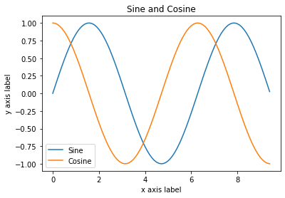

# Python Tutorial

## Basics of Python

Python is a high-level, dynamically typed multiparadigm programming language. Python code is often said to be almost like pseudocode, since it allows you to express very powerful ideas in very few lines of code while being very readable.

We recommend to read [PEP 8](https://www.python.org/dev/peps/pep-0008/).

### Python versions and Zen of Python

There are currently supported versions of Python 3.X. Support for Python 2.7 ended in 2020. For this class all code will use Python 3.7.

You can check your Python version at the command line by running python --version.


```python
!python --version
```

    Python 3.7.4


```python
import this
```

    The Zen of Python, by Tim Peters
    
    Beautiful is better than ugly.
    Explicit is better than implicit.
    Simple is better than complex.
    Complex is better than complicated.
    Flat is better than nested.
    Sparse is better than dense.
    Readability counts.
    Special cases aren't special enough to break the rules.
    Although practicality beats purity.
    Errors should never pass silently.
    Unless explicitly silenced.
    In the face of ambiguity, refuse the temptation to guess.
    There should be one-- and preferably only one --obvious way to do it.
    Although that way may not be obvious at first unless you're Dutch.
    Now is better than never.
    Although never is often better than *right* now.
    If the implementation is hard to explain, it's a bad idea.
    If the implementation is easy to explain, it may be a good idea.
    Namespaces are one honking great idea -- let's do more of those!


### Basic data types

#### Numbers

Integers and floats work as you would expect from other languages:


```python
x = 3
print(x, type(x))
```

    3 <class 'int'>


```python
print(x + 1)   # Addition;
print(x - 1)   # Subtraction;
print(x * 2)   # Multiplication;
print(x ** 2)  # Exponentiation;
```

    4
    2
    6
    9


```python
x += 1
print(x)  # Prints "4"
x *= 2
print(x)  # Prints "8"
```

    4
    8


```python
y = 2.5
print(type(y)) # Prints "<type 'float'>"
print(y, y + 1, y * 2, y ** 2) # Prints "2.5 3.5 5.0 6.25"
```

    <class 'float'>
    2.5 3.5 5.0 6.25


Note that unlike many languages, Python does not have unary increment (x++) or decrement (x--) operators.

Python also has built-in types for long integers and complex numbers; you can find all of the details in the [documentation](https://docs.python.org/3.7/library/stdtypes.html#numeric-types-int-float-long-complex).

#### Booleans

Python implements all of the usual operators for Boolean logic, but uses English words rather than symbols (`&&`, `||`, etc.):


```python
T, F = True, False
print(type(T)) # Prints "<type 'bool'>"
```

    <class 'bool'>


Now we let's look at the operations:


```python
print(T and F) # Logical AND;
print(T or F)  # Logical OR;
print(not T)   # Logical NOT;
print(T != F)  # Logical XOR;
```

    False
    True
    False
    True


#### Strings


```python
hello = 'hello'   # String literals can use single quotes
world = "world"   # or double quotes; it does not matter.
print(hello, len(hello))
```

    hello 5


```python
hw = hello + ' ' + world  # String concatenation
print(hw)  # prints "hello world"
```

    hello world


```python
hw12 = '%s %s %d' % (hello, world, 12)  # sprintf style string formatting
print(hw12)  # prints "hello world 12"
```

    hello world 12


String objects have a bunch of useful methods; for example:


```python
s = "hello"
print(s.capitalize())  # Capitalize a string; prints "Hello"
print(s.upper())       # Convert a string to uppercase; prints "HELLO"
print(s.rjust(7))      # Right-justify a string, padding with spaces; prints "  hello"
print(s.center(7))     # Center a string, padding with spaces; prints " hello "
print(s.replace('l', '(ell)'))  # Replace all instances of one substring with another;
                               # prints "he(ell)(ell)o"
print('  world '.strip())  # Strip leading and trailing whitespace; prints "world"
```

    Hello
    HELLO
      hello
     hello 
    he(ell)(ell)o
    world


You can find a list of all string methods in the [documentation](https://docs.python.org/3.7/library/stdtypes.html#string-methods).

### Containers

Python includes several built-in container types: lists, dictionaries, sets, and tuples.

#### Lists

A list is the Python equivalent of an array, but is resizeable and can contain elements of different types:


```python
xs = [3, 1, 2]   # Create a list
print(xs, xs[2])
print(xs[-1])     # Negative indices count from the end of the list; prints "2"
```

    [3, 1, 2] 2
    2


```python
xs[2] = 'foo'    # Lists can contain elements of different types
print(xs)
```

    [3, 1, 'foo']


```python
xs.append('bar') # Add a new element to the end of the list
print(xs)  
```

    [3, 1, 'foo', 'bar']


```python
x = xs.pop()     # Remove and return the last element of the list
print(x, xs) 
```

    bar [3, 1, 'foo']


As usual, you can find all the gory details about lists in the [documentation](https://docs.python.org/3.7/tutorial/datastructures.html#more-on-lists).

#### Slicing

In addition to accessing list elements one at a time, Python provides concise syntax to access sublists; this is known as slicing:


```python
nums = range(5)    # range is a built-in function that creates a list of integers
print(nums)         # Prints "[0, 1, 2, 3, 4]"
print(nums[2:4])    # Get a slice from index 2 to 4 (exclusive); prints "[2, 3]"
print(nums[2:])     # Get a slice from index 2 to the end; prints "[2, 3, 4]"
print(nums[:2])     # Get a slice from the start to index 2 (exclusive); prints "[0, 1]"
print(nums[:])      # Get a slice of the whole list; prints ["0, 1, 2, 3, 4]"
print(nums[:-1])    # Slice indices can be negative; prints ["0, 1, 2, 3]"
```

    range(0, 5)
    range(2, 4)
    range(2, 5)
    range(0, 2)
    range(0, 5)
    range(0, 4)


#### Loops

You can loop over the elements of a list like this:


```python
animals = ['cat', 'dog', 'monkey']
for animal in animals:
    print(animal)
```

    cat
    dog
    monkey


If you want access to the index of each element within the body of a loop, use the built-in `enumerate` function:


```python
animals = ['cat', 'dog', 'monkey']
for idx, animal in enumerate(animals):
    print('#%d: %s' % (idx + 1, animal))
```

    #1: cat
    #2: dog
    #3: monkey


#### List comprehensions:

When programming, frequently we want to transform one type of data into another. As a simple example, consider the following code that computes square numbers:


```python
nums = [0, 1, 2, 3, 4]
squares = []
for x in nums:
    squares.append(x ** 2)
print(squares)
```

    [0, 1, 4, 9, 16]


You can make this code simpler using a list comprehension:


```python
nums = [0, 1, 2, 3, 4]
squares = [x ** 2 for x in nums]
print(squares)
```

    [0, 1, 4, 9, 16]


List comprehensions can also contain conditions:


```python
nums = [0, 1, 2, 3, 4]
even_squares = [x ** 2 for x in nums if x % 2 == 0]
print(even_squares)
```

    [0, 4, 16]


#### Dictionaries

A dictionary stores (key, value) pairs, similar to a `Map` in Java or an object in Javascript. You can use it like this:


```python
d = {'cat': 'cute', 'dog': 'furry'}  # Create a new dictionary with some data
print(d['cat'])       # Get an entry from a dictionary; prints "cute"
print('cat' in d)     # Check if a dictionary has a given key; prints "True"
```

    cute
    True


```python
d['fish'] = 'wet'    # Set an entry in a dictionary
print(d['fish'])      # Prints "wet"
```

    wet


```python
print(d.get('monkey', 'N/A'))  # Get an element with a default; prints "N/A"
print(d.get('fish', 'N/A'))   # Get an element with a default; prints "wet"
```

    N/A
    wet


```python
del d['fish']        # Remove an element from a dictionary
print(d.get('fish', 'N/A')) # "fish" is no longer a key; prints "N/A"
```

    N/A


You can find all you need to know about dictionaries in the [documentation](https://docs.python.org/3.7/library/stdtypes.html#dict).

It is easy to iterate over the keys in a dictionary:


```python
d = {'person': 2, 'cat': 4, 'spider': 8}
for animal in d:
    legs = d[animal]
    print('A %s has %d legs' % (animal, legs))
```

    A person has 2 legs
    A cat has 4 legs
    A spider has 8 legs


Dictionary comprehensions: These are similar to list comprehensions, but allow you to easily construct dictionaries. For example:


```python
nums = [0, 1, 2, 3, 4]
even_num_to_square = {x: x ** 2 for x in nums if x % 2 == 0}
print(even_num_to_square)
```

    {0: 0, 2: 4, 4: 16}


#### Sets

A set is an unordered collection of distinct elements. As a simple example, consider the following:


```python
animals = {'cat', 'dog'}
print('cat' in animals)   # Check if an element is in a set; prints "True"
print('fish' in animals)  # prints "False"
```

    True
    False


```python
animals.add('fish')      # Add an element to a set
print('fish' in animals)
print(len(animals))       # Number of elements in a set;
```

    True
    3


```python
animals.add('cat')       # Adding an element that is already in the set does nothing
print(len(animals))       
animals.remove('cat')    # Remove an element from a set
print(len(animals))       
```

    3
    2


_Loops_: Iterating over a set has the same syntax as iterating over a list; however since sets are unordered, you cannot make assumptions about the order in which you visit the elements of the set:


```python
animals = {'cat', 'dog', 'fish'}
for idx, animal in enumerate(animals):
    print('#%d: %s' % (idx + 1, animal))
# Prints "#1: fish", "#2: dog", "#3: cat"
```

    #1: fish
    #2: dog
    #3: cat


Set comprehensions: Like lists and dictionaries, we can easily construct sets using set comprehensions:


```python
from math import sqrt
print({int(sqrt(x)) for x in range(30)})
```

    {0, 1, 2, 3, 4, 5}


#### Tuples

A tuple is an (immutable) ordered list of values. A tuple is in many ways similar to a list; one of the most important differences is that tuples can be used as keys in dictionaries and as elements of sets, while lists cannot. Here is a trivial example:


```python
d = {(x, x + 1): x for x in range(10)}  # Create a dictionary with tuple keys
t = (5, 6)       # Create a tuple
print(type(t))
print(d[t])       
print(d[(1, 2)])
```

    <class 'tuple'>
    5
    1


### Functions

Python functions are defined using the `def` keyword. For example:


```python
def sign(x: float) -> str:
    '''Function sign''' # document line
    
    if x > 0:
        return 'positive'
    elif x < 0:
        return 'negative'
    else:
        return 'zero'

for x in [-1, 0, 1]:
    print(sign(x))
```

    negative
    zero
    positive


```python
help(sign)
```

    Help on function sign in module __main__:
    
    sign(x: float) -> str
        Function sign
    


We will often define functions to take optional keyword arguments, like this:


```python
def hello(name: str, loud: bool=False) -> None:
    '''Function hello
    
    If loud is True, 
    then the name is printed in capital letters.
    '''
    
    if loud:
        print('HELLO, %s' % name.upper())
    else:
        print('Hello, %s!' % name)

hello('Bob')
hello('Fred', loud=True)
```

    Hello, Bob!
    HELLO, FRED


```python
help(hello)
```

    Help on function hello in module __main__:
    
    hello(name: str, loud: bool = False) -> None
        Function hello
        
        If loud is True, 
        then the name is printed in capital letters.
    


### Classes

The syntax for defining classes in Python is straightforward:


```python
class Greeter:
    '''Class Greeter
    
    method greet:
    If loud is True, 
    then the name is printed in capital letters.
    '''

    # Constructor
    def __init__(self, name):
        self.name = name  # Create an instance variable

    # Instance method
    def greet(self, loud: bool=False) ->None:
        if loud:
            print('HELLO, %s!' % self.name.upper())
        else:
            print('Hello, %s' % self.name)

g = Greeter('Fred')  # Construct an instance of the Greeter class
g.greet()            # Call an instance method; prints "Hello, Fred"
g.greet(loud=True)   # Call an instance method; prints "HELLO, FRED!"
```

    Hello, Fred
    HELLO, FRED!


```python
help(Greeter)
```

    Help on class Greeter in module __main__:
    
    class Greeter(builtins.object)
     |  Greeter(name)
     |  
     |  Class Greeter
     |  
     |  method greet:
     |  If loud is True, 
     |  then the name is printed in capital letters.
     |  
     |  Methods defined here:
     |  
     |  __init__(self, name)
     |      Initialize self.  See help(type(self)) for accurate signature.
     |  
     |  greet(self, loud: bool = False) -> None
     |      # Instance method
     |  
     |  ----------------------------------------------------------------------
     |  Data descriptors defined here:
     |  
     |  __dict__
     |      dictionary for instance variables (if defined)
     |  
     |  __weakref__
     |      list of weak references to the object (if defined)

## Numpy

Numpy is the core library for scientific computing in Python. It provides a high-performance multidimensional array object, and tools for working with these arrays.

To use Numpy, we first need to import the `numpy` package:


```python
import numpy as np
```

### Arrays

A numpy array is a grid of values, all of the same type, and is indexed by a tuple of nonnegative integers. The number of dimensions is the rank of the array; the shape of an array is a tuple of integers giving the size of the array along each dimension.

We can initialize numpy arrays from nested Python lists, and access elements using square brackets:


```python
a = np.array([1, 2, 3])  # Create a rank 1 array
print(type(a), a.shape, a[0], a[1], a[2])
a[0] = 5                 # Change an element of the array
print(a)                  
```

    <class 'numpy.ndarray'> (3,) 1 2 3
    [5 2 3]


```python
b = np.array([[1,2,3],[4,5,6]])   # Create a rank 2 array
print(b)
```

    [[1 2 3]
     [4 5 6]]


```python
print(b.shape)                   
print(b[0, 0], b[0, 1], b[1, 0])
```

    (2, 3)
    1 2 4


Numpy also provides many functions to create arrays:


```python
a = np.zeros((2,2))  # Create an array of all zeros
print(a)
```

    [[0. 0.]
     [0. 0.]]


```python
b = np.ones((1,2))   # Create an array of all ones
print(b)
```

    [[1. 1.]]


```python
c = np.full((2,2), 7) # Create a constant array
print(c) 
```

    [[7 7]
     [7 7]]


```python
d = np.eye(2)        # Create a 2x2 identity matrix
print(d)
```

    [[1. 0.]
     [0. 1.]]


```python
e = np.random.random((2,2)) # Create an array filled with random values
print(e)
```

    [[0.57584699 0.0757792 ]
     [0.18793454 0.78004389]]


### Array indexing

Numpy offers several ways to index into arrays.

Slicing: Similar to Python lists, numpy arrays can be sliced. Since arrays may be multidimensional, you must specify a slice for each dimension of the array:


```python
import numpy as np

# Create the following rank 2 array with shape (3, 4)
# [[ 1  2  3  4]
#  [ 5  6  7  8]
#  [ 9 10 11 12]]
a = np.array([[1,2,3,4], [5,6,7,8], [9,10,11,12]])

# Use slicing to pull out the subarray consisting of the first 2 rows
# and columns 1 and 2; b is the following array of shape (2, 2):
# [[2 3]
#  [6 7]]
b = a[:2, 1:3]
print(b)
```

    [[2 3]
     [6 7]]


A slice of an array is a view into the same data, so modifying it will modify the original array.


```python
print(a[0, 1])  
b[0, 0] = 77    # b[0, 0] is the same piece of data as a[0, 1]
print(a[0, 1]) 
```

    2
    77


You can also mix integer indexing with slice indexing. However, doing so will yield an array of lower rank than the original array.


```python
# Create the following rank 2 array with shape (3, 4)
a = np.array([[1,2,3,4], [5,6,7,8], [9,10,11,12]])
print(a)
```

    [[ 1  2  3  4]
     [ 5  6  7  8]
     [ 9 10 11 12]]


Two ways of accessing the data in the middle row of the array.
Mixing integer indexing with slices yields an array of lower rank,
while using only slices yields an array of the same rank as the
original array:


```python
row_r1 = a[1, :]    # Rank 1 view of the second row of a  
row_r2 = a[1:2, :]  # Rank 2 view of the second row of a
row_r3 = a[[1], :]  # Rank 2 view of the second row of a
print(row_r1, row_r1.shape) 
print(row_r2, row_r2.shape)
print(row_r3, row_r3.shape)
```

    [5 6 7 8] (4,)
    [[5 6 7 8]] (1, 4)
    [[5 6 7 8]] (1, 4)


```python
# We can make the same distinction when accessing columns of an array:
col_r1 = a[:, 1]
col_r2 = a[:, 1:2]
print(col_r1, col_r1.shape)
print(col_r2, col_r2.shape)
```

    [ 2  6 10] (3,)
    [[ 2]
     [ 6]
     [10]] (3, 1)


Integer array indexing: When you index into numpy arrays using slicing, the resulting array view will always be a subarray of the original array. In contrast, integer array indexing allows you to construct arbitrary arrays using the data from another array. Here is an example:


```python
a = np.array([[1,2], [3, 4], [5, 6]])

# An example of integer array indexing.
# The returned array will have shape (3,) and 
print(a[[0, 1, 2], [0, 1, 0]])

# The above example of integer array indexing is equivalent to this:
print(np.array([a[0, 0], a[1, 1], a[2, 0]]))
```

    [1 4 5]
    [1 4 5]


```python
# When using integer array indexing, you can reuse the same
# element from the source array:
print(a[[0, 0], [1, 1]])

# Equivalent to the previous integer array indexing example
print(np.array([a[0, 1], a[0, 1]]))
```

    [2 2]
    [2 2]


One useful trick with integer array indexing is selecting or mutating one element from each row of a matrix:


```python
# Create a new array from which we will select elements
a = np.array([[1,2,3], [4,5,6], [7,8,9], [10, 11, 12]])
print(a)
```

    [[ 1  2  3]
     [ 4  5  6]
     [ 7  8  9]
     [10 11 12]]


```python
# Create an array of indices
b = np.array([0, 2, 0, 1])

# Select one element from each row of a using the indices in b
print(a[np.arange(4), b])  # Prints "[ 1  6  7 11]"
```

    [ 1  6  7 11]


```python
# Mutate one element from each row of a using the indices in b
a[np.arange(4), b] += 10
print(a)
```

    [[11  2  3]
     [ 4  5 16]
     [17  8  9]
     [10 21 12]]


Boolean array indexing: Boolean array indexing lets you pick out arbitrary elements of an array. Frequently this type of indexing is used to select the elements of an array that satisfy some condition. Here is an example:


```python
import numpy as np

a = np.array([[1,2], [3, 4], [5, 6]])

bool_idx = (a > 2)  # Find the elements of a that are bigger than 2;
                    # this returns a numpy array of Booleans of the same
                    # shape as a, where each slot of bool_idx tells
                    # whether that element of a is > 2.

print(bool_idx)
```

    [[False False]
     [ True  True]
     [ True  True]]


```python
# We use boolean array indexing to construct a rank 1 array
# consisting of the elements of a corresponding to the True values
# of bool_idx
print(a[bool_idx])

# We can do all of the above in a single concise statement:
print(a[a > 2])
```

    [3 4 5 6]
    [3 4 5 6]


For brevity we have left out a lot of details about numpy array indexing; if you want to know more you should read the documentation.

### Datatypes

Every numpy array is a grid of elements of the same type. Numpy provides a large set of numeric datatypes that you can use to construct arrays. Numpy tries to guess a datatype when you create an array, but functions that construct arrays usually also include an optional argument to explicitly specify the datatype. Here is an example:


```python
x = np.array([1, 2])  # Let numpy choose the datatype
y = np.array([1.0, 2.0])  # Let numpy choose the datatype
z = np.array([1, 2], dtype=np.int64)  # Force a particular datatype

print(x.dtype, y.dtype, z.dtype)
```

    int64 float64 int64


You can read all about numpy datatypes in the [documentation](http://docs.scipy.org/doc/numpy/reference/arrays.dtypes.html).

### Array math

Basic mathematical functions operate elementwise on arrays, and are available both as operator overloads and as functions in the numpy module:


```python
x = np.array([[1,2],[3,4]], dtype=np.float64)
y = np.array([[5,6],[7,8]], dtype=np.float64)

# Elementwise sum; both produce the array
print(x + y)
print(np.add(x, y))
```

    [[ 6.  8.]
     [10. 12.]]
    [[ 6.  8.]
     [10. 12.]]


```python
# Elementwise difference; both produce the array
print(x - y)
print(np.subtract(x, y))
```

    [[-4. -4.]
     [-4. -4.]]
    [[-4. -4.]
     [-4. -4.]]


```python
# Elementwise product; both produce the array
print(x * y)
print(np.multiply(x, y))
```

    [[ 5. 12.]
     [21. 32.]]
    [[ 5. 12.]
     [21. 32.]]


```python
# Elementwise division; both produce the array
# [[ 0.2         0.33333333]
#  [ 0.42857143  0.5       ]]
print(x / y)
print(np.divide(x, y))
```

    [[0.2        0.33333333]
     [0.42857143 0.5       ]]
    [[0.2        0.33333333]
     [0.42857143 0.5       ]]


```python
# Elementwise square root; produces the array
# [[ 1.          1.41421356]
#  [ 1.73205081  2.        ]]
print(np.sqrt(x))
```

    [[1.         1.41421356]
     [1.73205081 2.        ]]


Note that unlike MATLAB, `*` is elementwise multiplication, not matrix multiplication. We instead use the dot function to compute inner products of vectors, to multiply a vector by a matrix, and to multiply matrices. dot is available both as a function in the numpy module and as an instance method of array objects:


```python
x = np.array([[1,2],[3,4]])
y = np.array([[5,6],[7,8]])

v = np.array([9,10])
w = np.array([11, 12])

# Inner product of vectors; both produce 219
print(v.dot(w))
print(np.dot(v, w))
```

    219
    219


```python
# Matrix / vector product; both produce the rank 1 array [29 67]
print(x.dot(v))
print(np.dot(x, v))
```

    [29 67]
    [29 67]


```python
# Matrix / matrix product; both produce the rank 2 array
# [[19 22]
#  [43 50]]
print(x.dot(y))
print(np.dot(x, y))
```

    [[19 22]
     [43 50]]
    [[19 22]
     [43 50]]


Numpy provides many useful functions for performing computations on arrays; one of the most useful is `sum`:


```python
x = np.array([[1,2],[3,4]])

print(np.sum(x))  # Compute sum of all elements; prints "10"
print(np.sum(x, axis=0))  # Compute sum of each column; prints "[4 6]"
print(np.sum(x, axis=1))  # Compute sum of each row; prints "[3 7]"
```

    10
    [4 6]
    [3 7]


You can find the full list of mathematical functions provided by numpy in the [documentation](http://docs.scipy.org/doc/numpy/reference/routines.math.html).

Apart from computing mathematical functions using arrays, we frequently need to reshape or otherwise manipulate data in arrays. The simplest example of this type of operation is transposing a matrix; to transpose a matrix, simply use the T attribute of an array object:


```python
print(x)
print(x.T)
```

    [[1 2]
     [3 4]]
    [[1 3]
     [2 4]]


```python
v = np.array([[1,2,3]])
print(v) 
print(v.T)
```

    [[1 2 3]]
    [[1]
     [2]
     [3]]


### Broadcasting

Broadcasting is a powerful mechanism that allows numpy to work with arrays of different shapes when performing arithmetic operations. Frequently we have a smaller array and a larger array, and we want to use the smaller array multiple times to perform some operation on the larger array.

For example, suppose that we want to add a constant vector to each row of a matrix. We could do it like this:


```python
# We will add the vector v to each row of the matrix x,
# storing the result in the matrix y
x = np.array([[1,2,3], [4,5,6], [7,8,9], [10, 11, 12]])
v = np.array([1, 0, 1])
y = np.empty_like(x)   # Create an empty matrix with the same shape as x

# Add the vector v to each row of the matrix x with an explicit loop
for i in range(4):
    y[i, :] = x[i, :] + v

print(y)
```

    [[ 2  2  4]
     [ 5  5  7]
     [ 8  8 10]
     [11 11 13]]


This works; however when the matrix `x` is very large, computing an explicit loop in Python could be slow. Note that adding the vector v to each row of the matrix `x` is equivalent to forming a matrix `vv` by stacking multiple copies of `v` vertically, then performing elementwise summation of `x` and `vv`. We could implement this approach like this:


```python
vv = np.tile(v, (4, 1))  # Stack 4 copies of v on top of each other
print(vv)                 # Prints "[[1 0 1]
                         #          [1 0 1]
                         #          [1 0 1]
                         #          [1 0 1]]"
```

    [[1 0 1]
     [1 0 1]
     [1 0 1]
     [1 0 1]]


```python
y = x + vv  # Add x and vv elementwise
print(y)
```

    [[ 2  2  4]
     [ 5  5  7]
     [ 8  8 10]
     [11 11 13]]


Numpy broadcasting allows us to perform this computation without actually creating multiple copies of v. Consider this version, using broadcasting:


```python
# We will add the vector v to each row of the matrix x,
# storing the result in the matrix y
x = np.array([[1,2,3], [4,5,6], [7,8,9], [10, 11, 12]])
v = np.array([1, 0, 1])
y = x + v  # Add v to each row of x using broadcasting
print(y)
```

    [[ 2  2  4]
     [ 5  5  7]
     [ 8  8 10]
     [11 11 13]]


The line `y = x + v` works even though `x` has shape `(4, 3)` and `v` has shape `(3,)` due to broadcasting; this line works as if v actually had shape `(4, 3)`, where each row was a copy of `v`, and the sum was performed elementwise.

Broadcasting two arrays together follows these rules:

1. If the arrays do not have the same rank, prepend the shape of the lower rank array with 1s until both shapes have the same length.
2. The two arrays are said to be compatible in a dimension if they have the same size in the dimension, or if one of the arrays has size 1 in that dimension.
3. The arrays can be broadcast together if they are compatible in all dimensions.
4. After broadcasting, each array behaves as if it had shape equal to the elementwise maximum of shapes of the two input arrays.
5. In any dimension where one array had size 1 and the other array had size greater than 1, the first array behaves as if it were copied along that dimension

If this explanation does not make sense, try reading the explanation from the [documentation](http://docs.scipy.org/doc/numpy/user/basics.broadcasting.html).

Functions that support broadcasting are known as universal functions. You can find the list of all universal functions in the [documentation](http://docs.scipy.org/doc/numpy/reference/ufuncs.html#available-ufuncs).

Here are some applications of broadcasting:


```python
# Compute outer product of vectors
v = np.array([1,2,3])  # v has shape (3,)
w = np.array([4,5])    # w has shape (2,)
# To compute an outer product, we first reshape v to be a column
# vector of shape (3, 1); we can then broadcast it against w to yield
# an output of shape (3, 2), which is the outer product of v and w:

print(np.reshape(v, (3, 1)) * w)
```

    [[ 4  5]
     [ 8 10]
     [12 15]]


```python
# Add a vector to each row of a matrix
x = np.array([[1,2,3], [4,5,6]])
# x has shape (2, 3) and v has shape (3,) so they broadcast to (2, 3),
# giving the following matrix:

print(x + v)
```

    [[2 4 6]
     [5 7 9]]


```python
# Add a vector to each column of a matrix
# x has shape (2, 3) and w has shape (2,).
# If we transpose x then it has shape (3, 2) and can be broadcast
# against w to yield a result of shape (3, 2); transposing this result
# yields the final result of shape (2, 3) which is the matrix x with
# the vector w added to each column. Gives the following matrix:

print((x.T + w).T)
```

    [[ 5  6  7]
     [ 9 10 11]]


```python
# Another solution is to reshape w to be a row vector of shape (2, 1);
# we can then broadcast it directly against x to produce the same
# output.
print(x + np.reshape(w, (2, 1)))
```

    [[ 5  6  7]
     [ 9 10 11]]


```python
# Multiply a matrix by a constant:
# x has shape (2, 3). Numpy treats scalars as arrays of shape ();
# these can be broadcast together to shape (2, 3), producing the
# following array:
print(x * 2)
```

    [[ 2  4  6]
     [ 8 10 12]]


Broadcasting typically makes your code more concise and faster, so you should strive to use it where possible.

This brief overview has touched on many of the important things that you need to know about numpy, but is far from complete. Check out the [numpy reference](http://docs.scipy.org/doc/numpy/reference/) to find out much more about numpy.

## Scipy

To be continued...

### Matplotlib

Matplotlib is a plotting library. In this section give a brief introduction to the `matplotlib.pyplot` module, which provides a plotting system similar to that of MATLAB.


```python
import matplotlib.pyplot as plt
```

By running this special iPython command, we will be displaying plots inline:


```python
%matplotlib inline
```

### Plotting

The most important function in `matplotlib` is plot, which allows you to plot 2D data. Here is a simple example:


```python
# Compute the x and y coordinates for points on a sine curve
x = np.arange(0, 3 * np.pi, 0.1)
y = np.sin(x)

# Plot the points using matplotlib
plt.plot(x, y)
```


    [<matplotlib.lines.Line2D at 0x1142b94d0>]


    

    


With just a little bit of extra work we can easily plot multiple lines at once, and add a title, legend, and axis labels:


```python
y_sin = np.sin(x)
y_cos = np.cos(x)

# Plot the points using matplotlib
plt.plot(x, y_sin)
plt.plot(x, y_cos)
plt.xlabel('x axis label')
plt.ylabel('y axis label')
plt.title('Sine and Cosine')
plt.legend(['Sine', 'Cosine'])
```


    <matplotlib.legend.Legend at 0x114390a50>


    

    


### Subplots 

You can plot different things in the same figure using the subplot function. Here is an example:


```python
# Compute the x and y coordinates for points on sine and cosine curves
x = np.arange(0, 3 * np.pi, 0.1)
y_sin = np.sin(x)
y_cos = np.cos(x)

# Set up a subplot grid that has height 2 and width 1,
# and set the first such subplot as active.
plt.subplot(2, 1, 1)

# Make the first plot
plt.plot(x, y_sin)
plt.title('Sine')

# Set the second subplot as active, and make the second plot.
plt.subplot(2, 1, 2)
plt.plot(x, y_cos)
plt.title('Cosine')

# Show the figure.
plt.show()
```


    

    


You can read much more about the `subplot` function in the [documentation](http://matplotlib.org/api/pyplot_api.html#matplotlib.pyplot.subplot).

## Holoviews

To be continued...


```python

```
