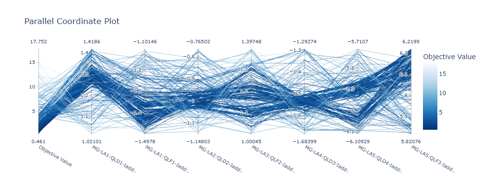
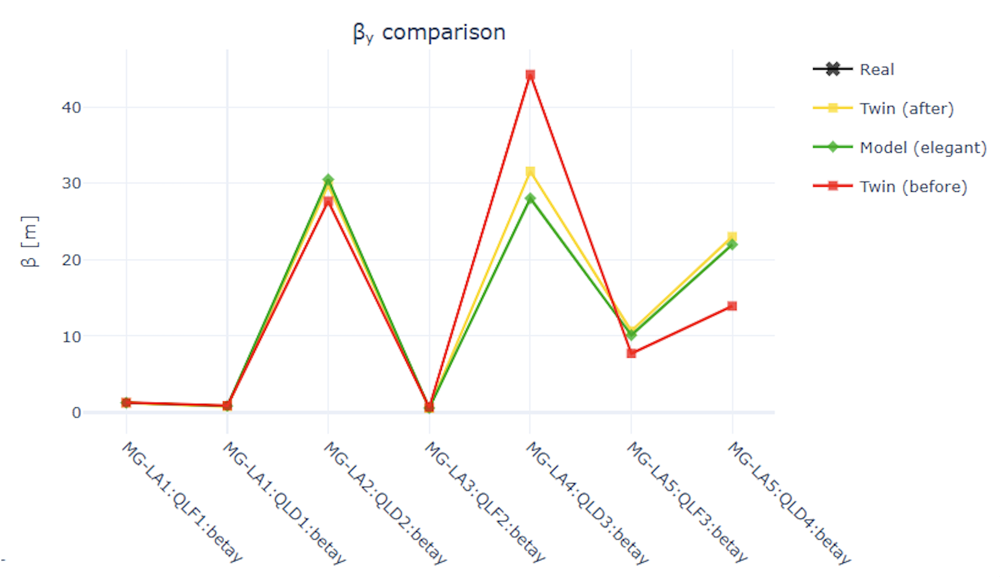
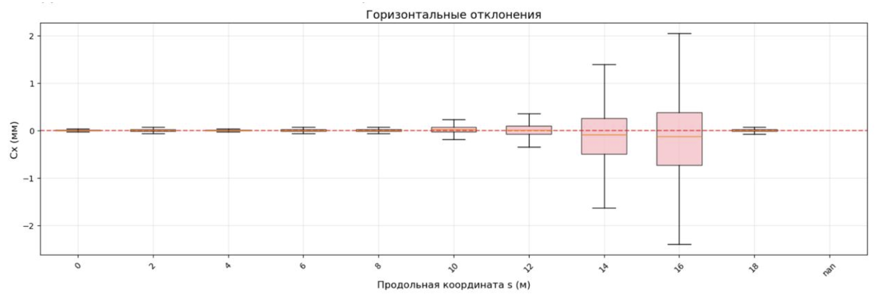

# Цифровой двойник ускорителя

Предыдущая глава собирала чертёж установки прямо из файла магнитной структуры. Эта рассказывает о программе, притворяющейся установкой.

## Задача

Пучковое время остаётся самым дефицитным ресурсом в институте. Смена, расписанная на месяцы вперёд, слишком дорога, чтобы тратить её на отладку скрипта коррекции. Вслепую скрипт, работающий с железом, тоже не напишешь. Пока он не поговорит с системой управления, неизвестно даже, верно ли названы каналы.

Отсюда идея **цифрового двойника** — программы, неотличимой от настоящей машины для всех остальных программ. Задача, поставленная в проекте **Accumulator**, звучит шире, чем «сделать модель». Нужна **ферма двойников**, то есть десятки виртуальных ускорителей, поднятых разом и отвечающих на те же команды, что и железо. На такой ферме отрабатывают алгоритмы AI/ML и параллельную оптимизацию, ничем при этом не рискуя и оставаясь в обстановке, приближенной к живой смене.

Собрана ферма из четырёх частей, у каждой своя роль. Физическим ядром работает **Elegant**, счётный код динамики пучка. Оболочкой служит **SCAUT**, библиотека, оркеструющая эксперименты на линаке инжектора СКИФ; её слои разобраны в главе [«От скрипта к приложению»](../dev/app.md). Интерфейсом наружу выставлен **EPICS IOC**, а размножается собранное [контейнерами Docker](../dev/docker.md).

## Как устроен один двойник

Ключевым здесь остаётся оборот «для остальных программ». Двойник устроен не как скрипт, запускающий Elegant, а как сервер, говорящий на протоколе EPICS Channel Access. Теми же именами каналов, в тех же единицах.

```
        ┌──────────────────────────────┐
        │  Клиент (Python / CS-Studio) │◄────────────┐
        └───────────────┬──────────────┘             │
                        │ caput / caget              │ readback PV
                        ▼                            │
        ┌──────────────────────────────┐             │
        │     EPICS Channel Access     │             │
        └───────────────┬──────────────┘             │
                        │ PV: ACC1:MG-LA1:QLF1:K1    │
                        ▼                            │
        ┌──────────────────────────────┐             │
        │      ElegantIOC (pcaspy)     │─────────────┘
        └───────────────┬──────────────┘◄────────────┐
                        │ eleput / eleget            │ результат
                        ▼                            │
        ┌──────────────────────────────┐             │
        │   Elegant (физическое ядро)  │─────────────┘
        └──────────────────────────────┘
```

Следствие, вытекающее из такой границы, простое и очень практичное. **Любой клиент, написанный для настоящей машины, работает с двойником без единой правки.** Скрипт коррекции, операторский экран, оптимизатор зовут `caget` и `caput` и не знают, с чем разговаривают: с железом или с контейнером, поднятым на ноутбуке.

Сервер собран на **pcaspy**. Точка входа `accumulator/main.py` разбирает файл структуры и передаёт полученный словарь каналов объекту `SimpleServer` вместе с префиксом экземпляра, взятым из переменной окружения. Дальше начинается цикл, в котором запросы, принимаемые по сети, обрабатываются с частотой, заданной в `IOC_REFRESH_RATE`. Вся физика убрана в драйвер `ElegantIOC`, унаследованный от `pcaspy.Driver`: у него два метода, `write` и `read`, вызываемые сервером на каждое обращение к каналу.

## Структура вместо списка каналов

Список каналов нигде не записан руками, а **выводится из описания магнитной структуры**. Файл `config.lte` описывает линак пятью секциями, и первая из них выглядит так.

```
MG-LA1.QLF1: QUAD, L=0.115, K1=-10.115
MG-LA1.D250: DRIFT, L=0.250
MG-LA1.CL2:  KICKER
MG-LA1.D150: DRIFT, L=0.100
MG-LA1.QLD1: QUAD, L=0.115, K1=8.67
MG-LA1.D400: DRIFT, L=0.400
BI-LA1.PK3:  MONI
```

Описаны в файле пять секций, набранных из квадруполей, корректоров, пикапов и дрейфов. Импульс, набираемый пучком, растёт от 38 МэВ/c на первой секции до 190 МэВ/c на пятой, а разгоняют его четыре резонатора с напряжением 36 МВ и частотой 2856 МГц, записанные тем же синтаксисом. Дрейфы и линии, перечисленные в файле, каналов не порождают: канал заводится только для элемента, чей тип найден в таблице обработчиков.

Рядом лежит таблица, где для каждого типа элемента перечислены параметры, выставляемые наружу. Отмечено и то, какие из перечисленных можно менять, а какие только читать.

```python
ELEMENT_HANDLERS = {
    'QUAD': {
        'K1':    {'pv_suffix': 'K1',    'is_read_only': False, 'scale': 1.0},
        'DX':    {'pv_suffix': 'DX',    'is_read_only': False, 'scale': PK_MONITOR_SCALE_FACTOR},
        'betax': {'pv_suffix': 'betax', 'is_read_only': True,  'scale': 1.0},
        'betay': {'pv_suffix': 'betay', 'is_read_only': True,  'scale': 1.0},
        ...
    },
    'MONI': {
        'Cx': {'pv_suffix': 'Cx', 'is_read_only': True, 'scale': PK_MONITOR_SCALE_FACTOR},
        'Cy': {'pv_suffix': 'Cy', 'is_read_only': True, 'scale': PK_MONITOR_SCALE_FACTOR},
        ...
    },
}
```

Разбор, идущий построчно, для каждого распознанного элемента порождает каналы по этой таблице.

```python
etype = tokens[0].upper()
if etype in ELEMENT_HANDLERS:
    for param_name, field_def in ELEMENT_HANDLERS[etype].items():
        pv_name = get_pv_name(name, field_def['pv_suffix'])
        initial_val_ele = parse_param_value(rest, field_def['param_name'])
        ...
        pvdb[pv_name] = {'type': 'float', 'prec': field_def['precision'],
                         'value': initial_val_ele * scale}
        element_map[pv_name] = {'name': name, 'type': etype,
                                'param': field_def['param_name'],
                                'read_only': field_def['is_read_only'],
                                'scale': scale}
```

Для линака из пяти секций получается 116 каналов: семь квадруполей по восемь штук, пять корректоров по четыре, пять пикапов по четыре, четыре резонатора по два и двенадцать на начальные условия пучка. Допиши в структуру ещё один квадруполь, и восемь новых каналов появятся сами, без единой правки, внесённой в код. Таблица описывает предметную область, программа её интерпретирует.

## Граница, на которой переводятся единицы

Самое интересное место лежит на стыке физики и системы управления, говорящих на разных языках. Внутри расчёта квадруполь описан так, как принято в физике пучков: `K1` означает градиент, нормализованный на жёсткость. А величина, задаваемая с пульта, — **ток источника питания в амперах**. Перевод, связывающий эти две величины, сводится к обычной физике.

$$
k_1 = 0{,}2998\,\frac{G\ [\text{Тл/м}]}{p\ [\text{ГэВ}/c]},
$$

и коэффициент, посчитанный по формуле, записан в конфигурации прямо с выводом.

```python
ENERGY_LA1 = 38e-3  # [GeV/c]
# 6 A ~ 6.3 [T/m] & k1 = 0.2998 * G [T/m] / P [GeV/c]
QL_QUAD_SCALE_FACTOR = 1 / 6 * 6.3 * 0.2998
PK_MONITOR_SCALE_FACTOR = 1e3  # m to mm

PV_MAPPING = {
    "MG-LA1.QLF1.K1": "MG-LA1:QLF1-Iadd:Set",
    "BI-LA1.PK3.Cx":  "BI-LA1:PK3-fastAvX:Mea",
}
SCALE_MAPPING = {
    "MG-LA1.QLF1.K1": ENERGY_LA1 / QL_QUAD_SCALE_FACTOR,
}
```

Подставь приведённые числа. Коэффициент выходит 0,1207, и \\( K_1 = -10{,}115 \\) даёт −1,22 А. В скане, записанном на работающей машине, тот же канал держит −1,3 А, то есть двойник и железо расходятся на 6 %. Для пересчёта «ток — градиент», построенного по одной опорной точке 6 А ~ 6,3 Тл/м, точность ожидаемая, и на таком уровне сценарии смены проверять уже можно.

Здесь же решается вторая задача — **имена**. По умолчанию канал зовётся `MG-LA1:QLF1:K1`, но таблица `PV_MAPPING` переименовывает его в `MG-LA1:QLF1-Iadd:Set`, ровно так, как этот источник питания назван на пульте. Пикап, измеряющий горизонтальное положение, отзывается на `BI-LA1:PK3-fastAvX:Mea`. Именно эти имена ждёт помощник оператора из [следующей главы](./sava.md).

## Что происходит по одному `caput`

Запись в канал не запоминает переданное значение, а пересчитывает физику, заложенную в структуру.

```python
def write(self, reason, value):
    element_info = self.element_map[reason]
    if element_info['read_only']:
        logger.warning(f"Attempt to write to read-only monitor {reason}")
        return False
    sim_name = get_sim_name(element_info['name'], element_info['param'])
    scale = element_info.get('scale', 1.0)
    val_to_write = value / scale
    eleput(sim_name, val_to_write)
    self.setParam(reason, value)
    return True
```

Сервер находит элемент, названный в имени канала, проверяет право на запись и делит значение на масштаб, переводя амперы обратно в \\( K_1 \\). Дальше `eleput`, взятый из SCAUT, дописывает параметр и заново запускает Elegant, трассирующий пучок через всю структуру. Один `caput` влечёт полный пересчёт: за ответом стоит решение уравнений движения, а не заготовленная таблица. Обратная функция `eleget` достаёт посчитанное из файлов результатов, когда клиент читает канал-монитор.

Проверить всё это можно двумя командами.

```bash
# положение пучка на третьем пикапе, миллиметры
caget ACC1:BI-LA1:PK3-fastAvX:Mea

# добавка к току первого квадруполя, амперы
caput ACC1:MG-LA1:QLF1-Iadd:Set -1.3
```

## Ферма

Подгонка двойника — задача оптимизации с дорого вычисляемой целевой функцией. Один шаг требует десятков запусков Elegant, и тысяча испытаний, поставленных подряд, считалась бы сутками. Распараллелить сам Elegant внутри процесса нельзя: он однопоточный и общается через файлы, разложенные в рабочем каталоге. Зато можно поднять **много его копий**, по контейнеру на экземпляр, каждый со своей файловой системой и своим префиксом каналов.

```
                     Локальная сеть
   ┌────────────────────────────────────────────┐
   │  Компьютер 1                               │
   │     ACC1   ACC2   ...   ACC30              │◄──────┐
   │                                            │       │
   │  Компьютер 2                               │       │   ┌───────────────┐
   │     ACC31  ACC32  ...   ACC60              │◄──────┼───│  Оркестратор  │
   │                                            │       │   │  Optuna / ГА  │
   │  Компьютер 3                               │       │   └───────────────┘
   │     ACC61  ACC62  ...   ACC90              │◄──────┘
   └────────────────────────────────────────────┘
```

Девяносто контейнеров разложены по трём компьютерам, соединённым локальной сетью. Все они подняты из одного образа, запущенного с разными переменными окружения, — тот самый принцип «артефакт один, конфигурация снаружи», разобранный в главе про [асинхронный веб-сервис](./async-api.md).

```yaml
accelerator-1:
  image: accumulator:latest
  container_name: acc-emulator-1
  env_file: accumulator.env
  environment:
    - 'ACCUMULATOR_PREFIX=ACC1:'
  ports: ['8501:8501', '5064:5064', '5065:5065/udp']
```

Описание, растянутое на девяносто одинаковых блоков, руками не пишут. Скрипт `generate_compose.py`, вызванный с числом экземпляров, раскладывает порты с заданным шагом и печатает готовый файл: `python scripts/generate_compose.py --count 90`. Веб-панель занимает 8501, 8502 и дальше подряд, а порты Channel Access расходятся тысячами. Клиенту, которому нужны все девяносто экземпляров сразу, помогает список адресов, передаваемый переменной `EPICS_CA_NAME_SERVERS`: поиск канала широковещательной рассылкой заменяется прямым опросом перечисленных серверов.

Внутри каждого контейнера supervisor держит два процесса, IOC и веб-панель, а образ несёт Elegant 2025.2.0 и набор утилит SDDS, поставленных поверх Ubuntu 22.04. Панель, сделанная на Streamlit, читает тот же файл структуры, показывает каналы, сгруппированные по элементам, и правит уставки мышкой, без единой строки, написанной клиентом.

Оркестратор раздаёт испытания по свободным экземплярам через обычную очередь.

```python
INSTANCE_POOL = queue.Queue()
for _p in PREFIXES:            # ACC1:, ACC2:, ... ACC89:
    INSTANCE_POOL.put(_p)

def objective(trial: optuna.Trial) -> float:
    prefix = INSTANCE_POOL.get()      # ждём свободный экземпляр
    try:
        values = [trial.suggest_float(p, lo, hi)
                  for p, (lo, hi) in zip(actuator_pvs, bounds)]
        apply_actuators(prefix, actuator_pvs, values, strip=REAL_PREFIX)
        ...
        return float(np.mean(step_losses))
    finally:
        INSTANCE_POOL.put(prefix)     # возвращаем при любом исходе
```

Очередь здесь не передаёт данные, а раздаёт **право пользоваться ресурсом**. Восемьдесят девять префиксов уходят в пул, а девяностый экземпляр оставлен нетронутым: по нему потом сверяют, каким двойник был до подгонки. Число параллельных заданий приравнено к размеру пула, а перебор ограничен тысячей испытаний и тысячей секунд.



## Цикл, ради которого всё затевалось

Двойник ценен как звено цикла, превращающего снятые измерения в уставки. Тетрадь `optuna_tuner.ipynb` проходит его целиком.

1. **Скан на реальной машине.** Десять корректоров пробегают заданную сетку, семнадцать каналов пишутся как отклик, и всё это ложится в JSON, снятый за 28 шагов.
2. **Подгонка двойника.** Optuna перебирает 26 параметров, девятнадцать сдвигов и углов рассогласования и семь токов квадруполей, добиваясь совпадения отклика двойника с измеренным. Невязка считается как средняя абсолютная разность, нормированная на шум пикапов, а испытание, оборванное ошибкой связи, получает штраф вместо падения всего перебора. Заведомо неудачные варианты обрубает `MedianPruner`, и на каждое испытание берётся десять шагов скана из двадцати восьми.
3. **Коррекция на двойнике.** Подогнанной модели ставят целью бета-функции номинального расчёта, четырнадцать чисел на семи квадруполях, и подбирают токи в пределах ±0,2 А от текущих.
4. **Перенос на железо.** Функция `apply_to_accelerator` сначала читает текущие значения, сохраняет прочитанное в файл снимка, печатает таблицу «было, станет, разница» и только потом, и только если явно передан `dry_run=False`, пишет в машину.
5. **Проверка.** Новый скан подтверждает, что стало лучше.

После второго шага двойник моделирует не «линак вообще», а **эту машину в этот день**, со всеми перекосами, пойманными в скане. В этом и разница между моделью и цифровым двойником.

Настроенный экземпляр получает отдельный префикс `ACCT:`, номинальный расчёт живёт под `ACCM:`, а за `ACC:` спрятана настоящая машина. Бета-функции, снятые со всех трёх, сводятся в одну таблицу, в которой видна невязка и до подгонки, и после неё.

## Что на ферме делают

**Отладка инженерного ПО для пультовой.** Программу, готовящуюся к работе в смене, прогоняют на виртуальном ускорителе. Алгоритм коррекции орбиты, разобранный в [отдельной главе](./orbit-correction.md), проверяется от начала до конца, включая имена каналов, порядок вызовов и поведение при потерянном ответе. Ошибка, найденная на двойнике, стоит перезапуска контейнера.

**Сравнение алгоритмов для исследований.** На одном и том же двойнике встают рядом байесовская оптимизация, эволюционный перебор из главы про [генетический алгоритм](./envelope-optimize.md) и обычный случайный поиск. Условия у всех одинаковые, отсюда и результаты, сравнимые между собой, а цена ошибки нулевая.



**Обучение ML/AI-моделей.** Девяносто экземпляров порождают размеченные данные в объёмах, недостижимых на живой установке: каждая пара «уставки — отклик» обходится в один прогон Elegant, а не в кусок смены. Выборка, набранная на ферме, покрывает и те режимы, до которых на реальной машине не доходят руки. На этих данных тренируют модели коррекции орбиты и обучают помощника оператора Саву, о котором говорит [следующая глава](./sava.md).



## Полезные ссылки

- [Accumulator](https://github.com/isyspac/accumulator), исходники двойника, разобранного в этой главе.
- [SCAUT](https://github.com/fuodorov/scaut), библиотека, оркеструющая эксперименты на ускорителе.
- [Elegant](https://ops.aps.anl.gov/elegant.html), код расчёта динамики пучка, положенный в основу двойника.
- [EPICS](https://epics-controls.org/), система управления, протокол которой двойник изображает.
- [pcaspy](https://pcaspy.readthedocs.io/), библиотека, позволяющая написать сервер EPICS на Python.
- [Optuna](https://optuna.org/), оптимизатор, которым подгоняют двойник под машину.
