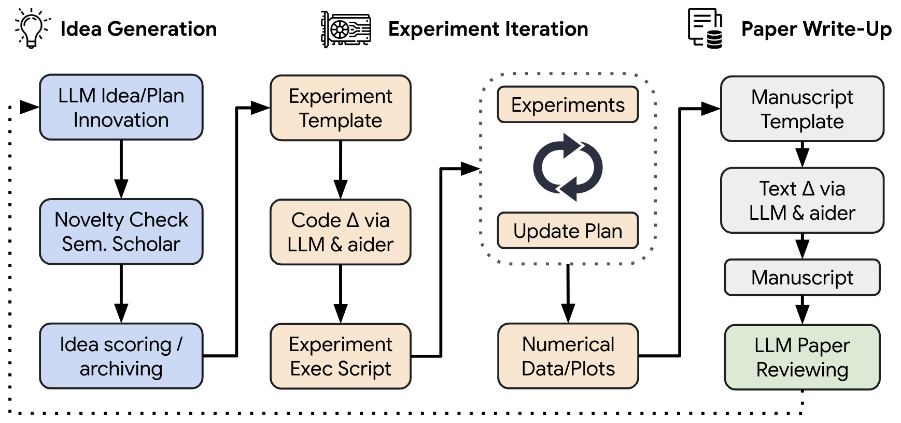
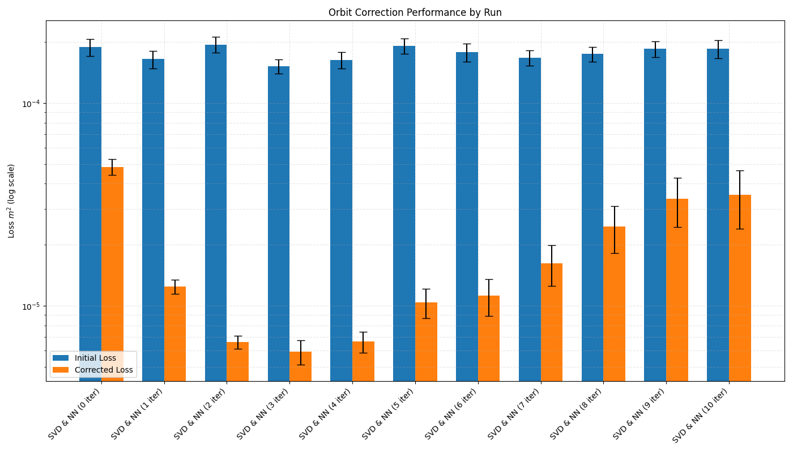

# Автономный исследователь на языковых моделях

Предыдущая глава разбирала [помощника оператора](./sava.md), поставленного рядом с человеком и ждущего подтверждения на каждую запись в железо. Здесь речь о системе, работающей вообще без человека в контуре: она сама выбирает задачу, сама ставит эксперимент и сама пишет статью по полученным числам.

## Что это такое

**Автономный исследователь** собран из большой языковой модели и обвязки, прогоняющей полный цикл научной работы. Он находит задачу, придумывает методику, ставит эксперимент, разбирает полученные числа и оформляет статью. Специализация узкая, ускорительная: коррекция орбиты пучка, управление магнитными элементами, оптимизация параметров, разбор данных измерений.

Основой служит открытая система [AI Scientist](https://github.com/SakanaAI/AI-Scientist), описанная в работе Lu et al. (2024) и приспособленная здесь к ускорителям. Приспособление свелось к одному новому шаблону, положенному рядом с готовыми шаблонами про языковые модели, диффузию и гроккинг. Шаблон, добавленный в форк, содержит постановку задачи, рабочий код, затравочные идеи и каркас статьи. Ничего специфически ускорительного в самой обвязке нет: вся физика собрана в шаблоне, подключаемом по имени каталога.



Схема делит работу на три стадии. На первой модель придумывает идею, проверяет её на новизну поиском по литературе и складывает в архив с оценками. На второй идея превращается в код: правки в `experiment.py` вносит `aider`, редактор, управляемый моделью, а обвязка запускает переписанное и возвращает модели напечатанные числа. Третья стадия собирает статью из каркаса LaTeX, после чего отдельный проход рецензирует написанное. Пунктирная стрелка, замыкающая схему, возвращает накопленные идеи в начало, так что следующая идея придумывается с оглядкой на уже проверенные.

Каждая идея, взятая из архива, отрабатывается в отдельном каталоге, куда копируется весь шаблон целиком. Ни один прогон не трогает исходный каталог, и любой результат, полученный системой, остаётся воспроизводимым: рядом с числами лежат и код, приведший к ним, и полная переписка с моделью, сохранённая построчно.

## Постановка задачи

Всё, что система знает о предметной области, взято из файла `prompt.json`. Роль и цель, поставленные перед моделью, заданы там первыми двумя полями.

```
System: You are an AI scientist specializing in accelerator physics and
beam dynamics with expertise in machine learning applications for particle
accelerator control systems. Your knowledge spans MAD-X simulations, beam
position monitoring (BPM) systems, and both traditional (SVD-based) and
AI-driven orbit correction methods.

Task: Minimize orbit deviations in the accelerator by optimizing corrector
magnet settings using a combination of numerical optimization and machine
learning techniques.
```

Дальше в том же файле перечислены требования, стесняющие решение, и среда, в которой считается орбита.

```json
"technical_requirements": [
    "Process beam position data from 16 BPMs (x/y coordinates)",
    "Account for hidden misalignment parameters affecting magnetic elements",
    "Maintain magnet currents within ±7A operational limits",
    "Achieve orbit residuals below 1e-4 m at all BPMs"
],
"simulation_environment": {
    "tool": "MAD-X",
    "configurations": [
        "vepp5_full.seq lattice",
        "0.4 GeV electron beam energy",
        "Error definitions: ealign with tgauss-distributed displacements"
    ]
}
```

Числа знакомые. Это та самая задача, разобранная в главе про [коррекцию равновесной орбиты](./orbit-correction.md): 16 датчиков положения, дающих по две координаты, предел корректора \\(\pm 7\\) А, модель накопителя ВЭПП-5. Разница в том, что ставится она не человеку, а программе.

Слово «hidden» в требованиях стоит не для красоты. Смещения магнитных элементов разыгрываются внутри модели и решателю не показываются, поэтому судить о них можно только по орбите, измеряемой в мониторах. Порог в \\(10^{-4}\\) м записан там же, и по нему система оценивает как свои прогоны, так и базу, посчитанную заранее.

Сам шаблон — обычный каталог, лежащий среди прочих.

```
templates/closed_orbit_correction/
├── prompt.json       постановка задачи и системная роль
├── seed_ideas.json   пять затравочных идей
├── experiment.py     расчёт орбиты и коррекция по SVD
├── plot.py           графики по собранным результатам
├── vepp5_full.seq    оптика ВЭПП-5, читаемая MAD-X
└── latex/            каркас статьи
```

Запускается прогон командой `python launch_scientist.py --experiment closed_orbit_correction`, и дальше человек не нужен до самого конца. Каталог результатов, названный по метке времени и имени идеи, заводится в начале работы.

## Точка отсчёта

Вместе с постановкой модели выдаётся работающий код, служащий и образцом, и базой сравнения. Ускоритель поднимается через `cpymad`, пучок электронов задан с энергией 0.43 ГэВ, а ошибки расстановки квадруполей разыгрываются директивой `ealign` с гауссом, усечённым на двух с половиной сигмах. Орбита снимается в шестнадцати мониторах, отобранных по классу `monitor`. Коррекция сделана классически, через псевдообратную матрицу отклика с отсечением малых сингулярных чисел.

```python
def correct_orbit(self):
    elem_val_limit = 7
    svd_cutoff = 1e-3
    target_orbit = np.zeros(2 * self.num_bpms)

    matrix = self.calculcate_resp_mat()
    inv_mat = np.linalg.pinv(matrix, rcond=svd_cutoff)

    madx = self.start_madx()
    x, y = self._get_orbit(madx)
    current_orbit = np.concatenate((x, y))

    tmp_elem_val = -inv_mat.dot(current_orbit - target_orbit)
    tmp_elem_val = np.clip(tmp_elem_val, -elem_val_limit, elem_val_limit)

    elems_deltas = dict(zip(self.globals.keys(), tmp_elem_val))
    self.change_elements(elems_deltas)
    x, y = self._get_orbit(madx)

    self.stop_madx(madx)
    return x, y, elems_deltas
```

Матрица отклика здесь не берётся из модели, а замеряется: каждый корректор двигают на шаг вверх и вниз, а разность откликов, снятых в мониторах, делят на этот шаг. Именно так поступают и на живой машине. Ограничение `np.clip` по \\(\pm 7\\) А стоит внутри алгоритма, до подачи токов, а не в проверке, приделанной после него. Опечатка в имени `calculcate_resp_mat` оставлена как есть, потому что на неё завязан код, написанный системой позже.

Этот файл модель видит целиком, вместе с постановкой. Идеи, предложенные дальше, сформулированы в терминах уже написанных методов: «доработать `correct_orbit`», «добавить в `calculcate_resp_mat` выбор подмножества корректоров».

## Идеи, придуманные системой

Пять затравочных идей лежат в `seed_ideas.json`, и модель дописывает к ним новые, читая постановку и код. В запрос кладётся весь архив, накопленный к этому моменту, чтобы новая идея не повторяла предыдущие. Каждая идея описана коротким планом эксперимента и снабжена тремя оценками от одного до десяти: интересность, выполнимость и новизна. Выставляет их сама модель, следуя просьбе, вписанной в запрос: быть осторожной и реалистичной.

Потом идёт доводка. Придуманное прогоняется через три раунда правки, где модель перечитывает и улучшает собственный ответ, а когда улучшать нечего, ответ помечается словами `I am done`. Затем идея проходит проверку на новизну: модель формулирует поисковые запросы, получает по десять статей с аннотациями из Semantic Scholar или OpenAlex и выносит вердикт строкой `Decision made: novel.` Раундов на решение отведено десять, но обычно хватает двух-трёх. Идеи, признанные несамостоятельными, до эксперимента не доходят.

Вот что система предложила по орбите.

| Идея | Int./Feas./Nov. |
|---|---|
| **Hybrid SVD-Neural Network Correction Framework.** Каскад: грубая коррекция по SVD, затем нейросеть, обученная на остатках. Сравнить чистые NN и SVD с гибридом. До 100 000 особей и до 10 итераций | 9 / 7 / 8 |
| **Genetic Algorithm for Optimizing Orbit Correction.** Генетический алгоритм с отбором, скрещиванием и мутацией для настройки корректоров. Сравнить норму \\(L_2\\) и время счёта с SVD и NN | 9 / 8 / 9 |
| **Predictive Control Using LSTM-Based Forecasting.** Предсказание положения пучка по истории BPM и упреждающая подстройка корректоров до появления отклонения | 9 / 5 / 9 |

Первая из них и пошла в работу.

## Эксперимент

Идею подхватывает цикл, отмеряющий системе строгий лимит попыток. Прогонов не больше пяти, неудачных заходов подряд не больше четырёх, и работа, не законченная в отведённых рамках, обрывается.

```python
MAX_ITERS, MAX_RUNS = 4, 5

def perform_experiments(idea, folder_name, coder, baseline_results) -> bool:
    current_iter, run = 0, 1
    next_prompt = coder_prompt.format(
        title=idea["Title"], idea=idea["Experiment"],
        max_runs=MAX_RUNS, baseline_results=baseline_results,
    )
    while run < MAX_RUNS + 1:
        if current_iter >= MAX_ITERS:
            break
        coder_out = coder.run(next_prompt)
        if "ALL_COMPLETED" in coder_out:
            break
        return_code, next_prompt = run_experiment(folder_name, run)
        if return_code == 0:
            run += 1
            current_iter = 0
        current_iter += 1
```

Обратная связь тут устроена просто. Каждый прогон запускается как `python experiment.py --out_dir=run_i`, и модель получает обратно либо посчитанные средние из `final_info.json`, либо последние полторы тысячи знаков `stderr`. Упавший прогон не обрывает работу, а возвращается модели текстом ошибки, по которому она правит код. Каталог неудачного захода при этом стирается, чтобы недосчитанное не попало в статью. Результаты, признанные годными, дописываются в `notes.txt` вместе с описанием прогона, и оттуда их потом берёт стадия письма. Код, исполняемый на этом шаге, написан языковой моделью, поэтому авторы системы советуют запирать прогон в контейнер, и `Dockerfile` для этого положен в репозиторий.

Когда счёт закончен, той же модели поручают переписать `plot.py` и перечислить в нём прогоны, достойные картинки. Заголовки, подписи осей и легенда выбираются на этом шаге, а описание каждого графика, составленное подробно, заносится в те же заметки.

Код гибридной коррекции система написала сама. Сеть в нём учится не отображению «орбита — токи» целиком, а поправке к решению, найденному через SVD, и поправка эта накапливается по итерациям.

```python
def hybrid_correct_orbit(self, model=None, iterations=0, svd=True):
    elem_val_limit = self.corr_limit
    x_new, y_new, elems_deltas = self.correct_orbit()   # грубая коррекция
    R = np.concatenate((x_new, y_new))
    if model is None:
        return x_new, y_new, elems_deltas

    dI_nn_total = np.zeros(len(self.globals)) + list(elems_deltas.values())
    for it in range(iterations):
        dI_nn = model.predict(R.reshape(1, -1))[0]      # поправка по остатку
        dI_nn_total += dI_nn
        dI_nn_total = np.clip(dI_nn_total, -elem_val_limit, elem_val_limit)

        self.change_elements(dict(zip(self.globals.keys(), dI_nn_total)))
        madx = self.start_madx()
        x_new, y_new = self._get_orbit(madx)
        self.stop_madx(madx)
        R = np.concatenate((x_new, y_new))

    return x_new, y_new, elems_deltas
```

Обучающая выборка набиралась отдельным прогоном: 100 000 случайных расстроек, для каждой снят остаток после SVD и посчитана идеальная добавка по номинальной матрице отклика, замеренной без расстроек. Сеть взята простая, `MLPRegressor` с двумя скрытыми слоями 64 и 32, а обученная модель сохранена в `nn_model.joblib` и дальше только читается. Прогоны с первого по десятый отличаются одним числом — количеством итераций сети, вынутым из имени каталога.



На картинке одиннадцать пар столбиков, по паре на прогон, и шкала логарифмическая. Синий столбик — начальная невязка \\(\sum (x_i^2 + y_i^2)\\) в м², оранжевый — остаточная, а усы, построенные по стандартной ошибке среднего, показывают разброс. В каждом прогоне сто независимых расстроек, разыгранных заново, поэтому начальная невязка держится примерно одинаковой от прогона к прогону, и оранжевые столбики сравнимы между собой. Нулевая итерация, посчитанная без сети, даёт чистый SVD: \\(1.9 \cdot 10^{-4}\\) м² до коррекции и \\(4.8 \cdot 10^{-5}\\) после. Три итерации сети дают \\(5.9 \cdot 10^{-6}\\), это лучшая точка на графике. К десятой итерации остаток возвращается к \\(3.5 \cdot 10^{-5}\\).

## Статья и рецензия

Написанием занимается тот же `aider`, но с другим набором файлов, открытых на правку: код эксперимента, заметки и `latex/template.tex`. Ссылки, вставляемые в текст, система ищет сама, тем же поиском по литературе. Готовый PDF собирается `pdflatex`, а `chktex` вычитывает разметку. Ошибки сборки, найденные этими программами, возвращаются модели тем же способом, что и ошибки счёта.

Последним включается рецензент. Статья, разобранная обратно в простой текст, подаётся модели с формой отзыва в стиле NeurIPS, где надо выставить оценки за оригинальность, качество, ясность и значимость, дать общую оценку от одного до десяти и вынести решение Accept или Reject. Отзывов собирается пять, они сводятся мета-рецензентом, температура выставлена в 0.1. Статья про гибридную коррекцию, оценённая собственным рецензентом на 3 из 10, отклонена им же.

## Ограничения и что дальше

Список ограничений, признанных за системой, короткий.

- **Нет работы с изображениями.** Модель читает только числа и текст, а на построенные графики не смотрит вовсе.
- **Идеи реализуются неверно.** Написанный код бывает не тем, что задумано в описании эксперимента.
- **Ошибки в численном анализе.** Величины, сравниваемые между собой, модель путает, а выводы, сделанные по таблицам, даются ей плохо.
- **Ограниченная физическая интерпретация.** Система работает с формой задачи, а не с её содержанием.

Направления, названные для дальнейшей работы: мультимодальные модели, умеющие читать графики; специализированные модули под предметную область; интеграция с реальными установками; развитие самих языковых моделей, лежащих в основе.

## Полезные ссылки

- [AI Scientist](https://github.com/SakanaAI/AI-Scientist), исходная система, и статья Lu et al. (2024), [arXiv:2408.06292](https://arxiv.org/abs/2408.06292).
- [AI Scientist v2](https://github.com/SakanaAI/AI-Scientist-v2), следующая версия, заменившая шаблоны поиском по дереву экспериментов.
- [Форк с шаблоном по коррекции орбиты](https://github.com/fuodorov/ai-scientist), откуда взяты листинги этой главы.
- [MAD-X](https://mad.web.cern.ch/mad/) и [cpymad](https://github.com/hibtc/cpymad), на которых считается оптика ВЭПП-5.
- [aider](https://aider.chat/), редактор, вносящий правки в код по указаниям модели.
- Глава про [коррекцию равновесной орбиты](./orbit-correction.md) разбирает ту же задачу руками, а глава про [нейронные сети](../ds/nn.md) — устройство `MLPRegressor`.
