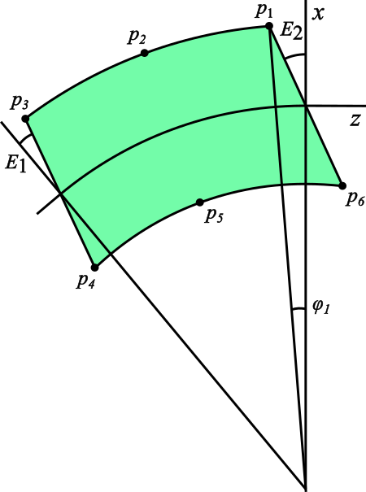
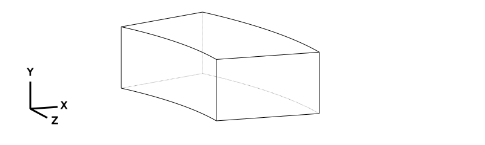
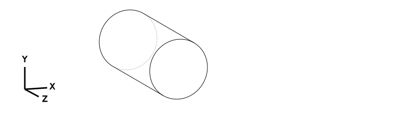
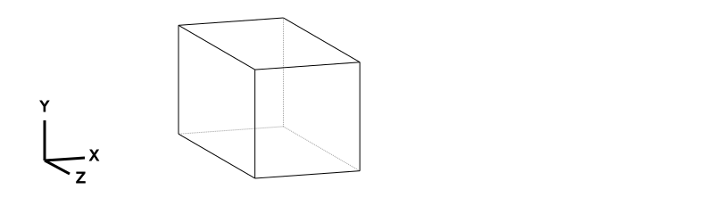
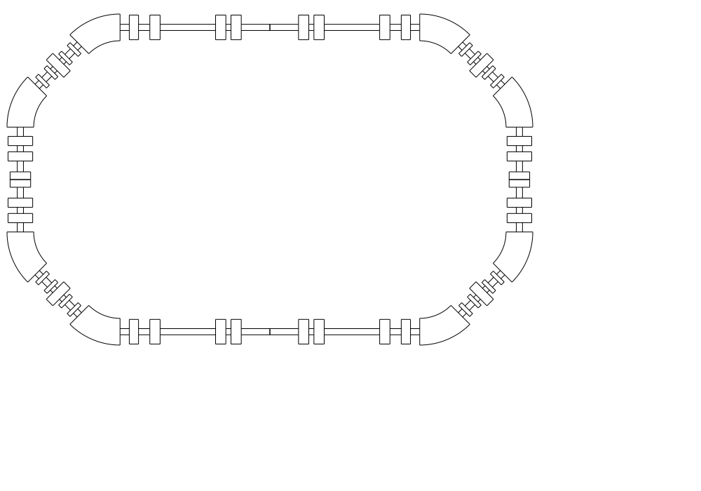

# Accelerator beamline layout in [CadQuery](https://cadquery.readthedocs.io)
[A. Petrenko](https://www.inp.nsk.su/~petrenko/) (Novosibirsk, 2024)


```python
import numpy as np
import pandas as pd
import os, glob
import cadquery as cq
from cadquery import exporters
from IPython.display import SVG
from io import StringIO
```


```python
if not os.path.exists("results/"): os.mkdir("results/")
# clear the "results" folder:
for f in glob.glob('results/*'): os.remove(f)
```


```python
with open("machine.lte", "r") as f:
    print(f.read())
```

    CAV     : RFCA,  L=0.15, VOLT=200e3,FREQ=700e6,PHASE=0.00106193
    D5      : DRIFT, L=0.21                                   
    QD1     : QUAD, L=0.18, K1=-7.05620223 
    D6      : DRIFT, L=0.12                    
    QF1     : QUAD, L=0.18, K1=13.7964021 
    QF2     : QUAD, L=0.18, K1=12.0670253 
    QF3     : QUAD, L=0.18, K1=13.7964021 
    D7      : DRIFT, L=0.22                  
    QD2     : QUAD, L=0.2, K1=-3.3450147
    D8      : DRIFT, L=1.08                
    QD3     : QUAD, L=0.2, K1=-9.16643151    
    D9      : DRIFT, L=0.1                
    QF4     : QUAD, L=0.2, K1=8.54245738
    D10     : DRIFT, L=0.5575              
    
    DB      : SBEND, L=0.88, ANGLE=0.785399, K1=-2.3515579 
    
    D1      : DRIFT, L=0.18
    D2      : DRIFT, L=0.105
    D3      : DRIFT, L=0.155
    D4      : DRIFT, L=0.07
    
    SZ1     : SEXTUPOL, L=0.08, K2=-250
    SZ2     : SEXTUPOL, L=0.08, K2=-250
    SX1     : SEXTUPOL, L=0.08, K2=160
    SX2     : SEXTUPOL, L=0.08, K2=160
    
    BEND1 : LINE=(D1,DB,D2,SZ1,D3,SX1,D4)
    BEND2 : LINE=(D4,SX2,D3,SZ2,D2,DB,D1)
    
    DAMP    : LINE=(CAV,D5,QD1,D6,QF1,BEND1,QF2,BEND2,QF3,D7, &
                     QD2,D8,QD3,D9,QF4,D10)
    
    ! machine : LINE=(DAMP,-DAMP,DAMP,-DAMP)
     machine : LINE=(-DAMP,DAMP,-DAMP,DAMP)


```python
out = !elegant floor_coordinates.ele
print("\n".join(out[-20:]))
```

    Updating floor coordinates
    tracking step 1
    generating bunch 1
    tracking 1 particles
    23 Nov 25 16:20:13: This step establishes energy profile vs s (fiducial beam).
    23 Nov 25 16:20:13: Rf phases/references reset.
    Post-tracking output completed.
    Tracking step completed   ET:  00:00:0.009 CP:    0.00 BIO:0 DIO:0 PF:0 MEM:7094
    
    
    Saving lattice parameters to results/parameters.sdds...done.
    Finished tracking.
    End of input data encountered.
    statistics:    ET:  00:00:0.016 CP:    0.01 BIO:0 DIO:0 PF:0 MEM:7183
    =====================================================================================
    Thanks for using elegant.  Please cite the following reference in your publications:
      M. Borland, "elegant: A Flexible SDDS-Compliant Code for Accelerator Simulation,"
      Advanced Photon Source LS-287, September 2000.
    If you use a modified version, please indicate this in all publications.
    =====================================================================================


```python
# read SDDS-file into pandas dataframe
def sdds2df(sdds_file, columns="all"):
    if columns=="all":
        columns = !sddsquery $sdds_file -columnlist
    col_str = "-col=" + ",".join(columns)
    out = !sdds2stream $sdds_file $col_str -pipe=out
    DATA = StringIO("\n".join(out))
    df = pd.read_csv(DATA, names=columns, sep=r'\s+')
    return df

def element_par(ElementName, ElementParameter, ElementOccurence=1, filename="results/parameters.sdds"):
    out = !sddsprocess $filename -pipe=out \
        -match=col,ElementName=$ElementName \
        -match=col,ElementParameter=$ElementParameter \
        -filter=col,ElementOccurence,$ElementOccurence,$ElementOccurence | \
     sdds2stream -pipe=in -col=ParameterValue

    try:
        return float(out[0])
    except ValueError:
        return out[0]

#element_par("DPL101","ANGLE")*180/np.pi
```


```python
floor_file = "results/xyz.sdds"
df = sdds2df(floor_file)
```


```python
df.head(3)
```


<div>
<style scoped>
    .dataframe tbody tr th:only-of-type {
        vertical-align: middle;
    }

    .dataframe tbody tr th {
        vertical-align: top;
    }

    .dataframe thead th {
        text-align: right;
    }
</style>
<table border="1" class="dataframe">
  <thead>
    <tr style="text-align: right;">
      <th></th>
      <th>s</th>
      <th>ds</th>
      <th>X</th>
      <th>Y</th>
      <th>Z</th>
      <th>theta</th>
      <th>phi</th>
      <th>psi</th>
      <th>ElementName</th>
      <th>ElementOccurence</th>
      <th>ElementType</th>
      <th>NextElementName</th>
      <th>NextElementType</th>
    </tr>
  </thead>
  <tbody>
    <tr>
      <th>0</th>
      <td>0.0000</td>
      <td>0.0000</td>
      <td>0.0</td>
      <td>0.0</td>
      <td>0.0000</td>
      <td>0.0</td>
      <td>0.0</td>
      <td>0.0</td>
      <td>_BEG_</td>
      <td>1</td>
      <td>MARK</td>
      <td>QF4</td>
      <td>MARK</td>
    </tr>
    <tr>
      <th>1</th>
      <td>0.5575</td>
      <td>0.5575</td>
      <td>0.0</td>
      <td>0.0</td>
      <td>0.5575</td>
      <td>0.0</td>
      <td>0.0</td>
      <td>0.0</td>
      <td>D10</td>
      <td>1</td>
      <td>DRIF</td>
      <td>QF4</td>
      <td>QUAD</td>
    </tr>
    <tr>
      <th>2</th>
      <td>0.7575</td>
      <td>0.2000</td>
      <td>0.0</td>
      <td>0.0</td>
      <td>0.7575</td>
      <td>0.0</td>
      <td>0.0</td>
      <td>0.0</td>
      <td>QF4</td>
      <td>1</td>
      <td>QUAD</td>
      <td>D9</td>
      <td>DRIF</td>
    </tr>
  </tbody>
</table>
</div>


```python
df.tail(10)
```


<div>
<style scoped>
    .dataframe tbody tr th:only-of-type {
        vertical-align: middle;
    }

    .dataframe tbody tr th {
        vertical-align: top;
    }

    .dataframe thead th {
        text-align: right;
    }
</style>
<table border="1" class="dataframe">
  <thead>
    <tr style="text-align: right;">
      <th></th>
      <th>s</th>
      <th>ds</th>
      <th>X</th>
      <th>Y</th>
      <th>Z</th>
      <th>theta</th>
      <th>phi</th>
      <th>psi</th>
      <th>ElementName</th>
      <th>ElementOccurence</th>
      <th>ElementType</th>
      <th>NextElementName</th>
      <th>NextElementType</th>
    </tr>
  </thead>
  <tbody>
    <tr>
      <th>103</th>
      <td>24.5125</td>
      <td>0.8800</td>
      <td>1.952624e-05</td>
      <td>0.0</td>
      <td>-2.91748</td>
      <td>-0.000007</td>
      <td>0.0</td>
      <td>0.0</td>
      <td>DB</td>
      <td>8</td>
      <td>SBEN</td>
      <td>D1</td>
      <td>DRIF</td>
    </tr>
    <tr>
      <th>104</th>
      <td>24.6925</td>
      <td>0.1800</td>
      <td>1.832153e-05</td>
      <td>0.0</td>
      <td>-2.73748</td>
      <td>-0.000007</td>
      <td>0.0</td>
      <td>0.0</td>
      <td>D1</td>
      <td>8</td>
      <td>DRIF</td>
      <td>QF3</td>
      <td>QUAD</td>
    </tr>
    <tr>
      <th>105</th>
      <td>24.8725</td>
      <td>0.1800</td>
      <td>1.711682e-05</td>
      <td>0.0</td>
      <td>-2.55748</td>
      <td>-0.000007</td>
      <td>0.0</td>
      <td>0.0</td>
      <td>QF3</td>
      <td>4</td>
      <td>QUAD</td>
      <td>D7</td>
      <td>DRIF</td>
    </tr>
    <tr>
      <th>106</th>
      <td>25.0925</td>
      <td>0.2200</td>
      <td>1.564440e-05</td>
      <td>0.0</td>
      <td>-2.33748</td>
      <td>-0.000007</td>
      <td>0.0</td>
      <td>0.0</td>
      <td>D7</td>
      <td>4</td>
      <td>DRIF</td>
      <td>QD2</td>
      <td>QUAD</td>
    </tr>
    <tr>
      <th>107</th>
      <td>25.2925</td>
      <td>0.2000</td>
      <td>1.430584e-05</td>
      <td>0.0</td>
      <td>-2.13748</td>
      <td>-0.000007</td>
      <td>0.0</td>
      <td>0.0</td>
      <td>QD2</td>
      <td>4</td>
      <td>QUAD</td>
      <td>D8</td>
      <td>DRIF</td>
    </tr>
    <tr>
      <th>108</th>
      <td>26.3725</td>
      <td>1.0800</td>
      <td>7.077591e-06</td>
      <td>0.0</td>
      <td>-1.05748</td>
      <td>-0.000007</td>
      <td>0.0</td>
      <td>0.0</td>
      <td>D8</td>
      <td>4</td>
      <td>DRIF</td>
      <td>QD3</td>
      <td>QUAD</td>
    </tr>
    <tr>
      <th>109</th>
      <td>26.5725</td>
      <td>0.2000</td>
      <td>5.739027e-06</td>
      <td>0.0</td>
      <td>-0.85748</td>
      <td>-0.000007</td>
      <td>0.0</td>
      <td>0.0</td>
      <td>QD3</td>
      <td>4</td>
      <td>QUAD</td>
      <td>D9</td>
      <td>DRIF</td>
    </tr>
    <tr>
      <th>110</th>
      <td>26.6725</td>
      <td>0.1000</td>
      <td>5.069745e-06</td>
      <td>0.0</td>
      <td>-0.75748</td>
      <td>-0.000007</td>
      <td>0.0</td>
      <td>0.0</td>
      <td>D9</td>
      <td>4</td>
      <td>DRIF</td>
      <td>QF4</td>
      <td>QUAD</td>
    </tr>
    <tr>
      <th>111</th>
      <td>26.8725</td>
      <td>0.2000</td>
      <td>3.731181e-06</td>
      <td>0.0</td>
      <td>-0.55748</td>
      <td>-0.000007</td>
      <td>0.0</td>
      <td>0.0</td>
      <td>QF4</td>
      <td>4</td>
      <td>QUAD</td>
      <td>D10</td>
      <td>DRIF</td>
    </tr>
    <tr>
      <th>112</th>
      <td>27.4300</td>
      <td>0.5575</td>
      <td>-6.630707e-11</td>
      <td>0.0</td>
      <td>0.00002</td>
      <td>-0.000007</td>
      <td>0.0</td>
      <td>0.0</td>
      <td>D10</td>
      <td>4</td>
      <td>DRIF</td>
      <td>_END_</td>
      <td>MARK</td>
    </tr>
  </tbody>
</table>
</div>


https://mad8.web.cern.ch/doc/mad8_user.pdf




```python
#element_width  = 1.0 # m
element_width  = 0.4 # m

pipe_width = element_width*0.3
quad_width = element_width*1.2
sext_width = element_width*0.75

dipole_width = element_width*1.3
dipole_height = element_width*0.75

mm = 1e-3
```


```python
def SBEND(angle=np.pi/4, L=1.0, e1=0, e2=0, width=dipole_width, height=dipole_height):
    w = width/mm # mm
    h = height/mm # mm
    R = (L/mm)/angle # mm
    # Orbit cirlce center
    z0 = 0; x0 = -R

    def point(r, phi):
        z = z0 - r*np.sin(phi)
        x = x0 + r*np.cos(phi)
        return z, x

    #phi = e2 - np.arcsin(R*np.sin(e2)/(R + width/2)) # rad

    # e1=e2=0 case first:
    phi = e2 - np.arcsin(R*np.sin(e2)/(R + w/2)) # rad
    p1 = point(R+w/2, phi)

    phi = angle/2
    p2 = point(R+w/2, phi)
    
    phi = angle - ( e1 - np.arcsin(R*np.sin(e1)/(R + w/2)) ) # rad
    p3 = point(R+w/2, phi)
    
    phi = angle - ( e1 - np.arcsin(R*np.sin(e1)/(R - w/2)) ) # rad
    p4 = point(R-w/2, phi)

    phi = angle/2
    p5 = point(R-w/2, phi)

    phi = e2 - np.arcsin(R*np.sin(e2)/(R - w/2)) # rad
    p6 = point(R-w/2, phi)

    return (
        cq.Workplane("ZX")
        .lineTo(*p1)
        .threePointArc(p2, p3)
        .lineTo(*p4)
        .threePointArc(p5, p6)
        .close()
        .extrude(h)
        .translate((0, -h/2, 0))
    )
```


```python
#bend = SBEND(angle=np.pi/8, L=1.0, e1=0, e2=np.pi/8)
bend = SBEND(angle=np.pi/8, L=1.0, e1=0, e2=0)

SVG(bend.toSvg())
```


    

    


```python
SVG(bend.toSvg(opts={"projectionDir": (0, 1, 0), "marginLeft": 10, "marginRight": 10}))
```


    

    


```python
def box(L=1.0, width=element_width, height=element_width):
    w = width/mm # mm
    h = height/mm # mm

    return (
        cq.Workplane("ZX")
        .lineTo(0,w/2)
        .lineTo(-L/mm,  w/2)
        .lineTo(-L/mm, -w/2)
        .lineTo(0, -w/2)
        .close()
        .extrude(h)
        .translate((0, -h/2, 0))
    )
```


```python
def cylinder(L=1.0, D=element_width):
    return (
        cq.Workplane("XY")
        .circle(D/2/mm).extrude(L/mm)
        .translate((0, 0, -L/mm))
    )
```


```python
SVG(cylinder().toSvg())
```


    

    


```python
def QUAD(L=1.0, width=quad_width):
    return box(L=L, width=width, height=width)

SVG(QUAD().toSvg())
```


    

    


```python
def SEXT(L=1.0, width=sext_width):
    return box(L=L, width=width, height=width)

#SVG(SEXT().toSvg())
```


```python
#bend
```


```python
assy = cq.Assembly()

opacity = 0.8

for index, row in df.iterrows():
    name = row.ElementName
    if row.ElementOccurence > 1: name = f"{row.ElementName}.{row.ElementOccurence}"
    L     = row.ds
    if row.ElementType.endswith("SBEN"):
        angle = element_par(row.ElementName, "ANGLE", ElementOccurence=row.ElementOccurence)
        e1    = element_par(row.ElementName, "E1",    ElementOccurence=row.ElementOccurence)
        e2    = element_par(row.ElementName, "E2",    ElementOccurence=row.ElementOccurence)
        print(f"SBEND: {name}: X={row.X:.3f}, Y={row.Y:.3f}, Z={row.Z:.3f}, L ={L:.3f}, angle={angle:.3f}, e1={e1:.3f}, e2={e2:.3f}")
        
        bend = SBEND(angle=angle, L=L, e1=e1, e2=e2)
        
        assy.add(
            bend,
            color=cq.Color(0, 1, 0, opacity),
            name=name,
            loc=cq.Location((row.X/mm, row.Y/mm, row.Z/mm), (0, 1, 0), 180*row.theta/np.pi)
        )
    elif row.ElementType.endswith("QUAD"):
        print(f"QUAD: {name}: X={row.X:.3f}, Y={row.Y:.3f}, Z={row.Z:.3f}, L ={L:.3f}")
        
        assy.add(
            QUAD(L=L),
            color=cq.Color(1, 165/255, 0, opacity),
            name=name,
            loc=cq.Location((row.X/mm, row.Y/mm, row.Z/mm), (0, 1, 0), 180*row.theta/np.pi)
        )
    elif row.ElementType.endswith("SEXT"):
        print(f"SEXT: {name}: X={row.X:.3f}, Y={row.Y:.3f}, Z={row.Z:.3f}, L ={L:.3f}")
        
        assy.add(
            SEXT(L=L),
            color=cq.Color(0, 0, 1, opacity),
            name=name,
            loc=cq.Location((row.X/mm, row.Y/mm, row.Z/mm), (0, 1, 0), 180*row.theta/np.pi)
        )
    elif row.ElementType == "DRIF":
        print(f"{row.ElementType}: {name}: X={row.X:.3f}, Y={row.Y:.3f}, Z={row.Z:.3f}, L ={L:.3f}")
        assy.add(
            cylinder(L=L, D=pipe_width),
            color=cq.Color(0.8, 0.8, 0.8, opacity),
            name=name,
            loc=cq.Location((row.X/mm, row.Y/mm, row.Z/mm), (0, 1, 0), 180*row.theta/np.pi)
        )
    elif row.ElementType == "RFCA" and L!=0:
        print(f"{row.ElementType}: {name}: X={row.X:.3f}, Y={row.Y:.3f}, Z={row.Z:.3f}, L ={L:.3f}")
        assy.add(
            cylinder(L=L),
            color=cq.Color(1.0, 0, 0, opacity),
            name=name,
            loc=cq.Location((row.X/mm, row.Y/mm, row.Z/mm), (0, 1, 0), 180*row.theta/np.pi)
        )
    elif L!=0:
        print(f"{row.ElementType}: {name}: X={row.X:.3f}, Y={row.Y:.3f}, Z={row.Z:.3f}, L ={L:.3f}")
        assy.add(
            box(L=L),
            color=cq.Color(0, 0, 0, opacity),
            name=name,
            loc=cq.Location((row.X/mm, row.Y/mm, row.Z/mm), (0, 1, 0), 180*row.theta/np.pi)
        )
        
```

    DRIF: D10: X=0.000, Y=0.000, Z=0.557, L =0.557
    QUAD: QF4: X=0.000, Y=0.000, Z=0.758, L =0.200
    DRIF: D9: X=0.000, Y=0.000, Z=0.858, L =0.100
    QUAD: QD3: X=0.000, Y=0.000, Z=1.058, L =0.200
    DRIF: D8: X=0.000, Y=0.000, Z=2.138, L =1.080
    QUAD: QD2: X=0.000, Y=0.000, Z=2.337, L =0.200
    DRIF: D7: X=0.000, Y=0.000, Z=2.558, L =0.220
    QUAD: QF3: X=0.000, Y=0.000, Z=2.738, L =0.180
    DRIF: D1: X=0.000, Y=0.000, Z=2.918, L =0.180
    SBEND: DB: X=-0.328, Y=0.000, Z=3.710, L =0.880, angle=0.785, e1=0.000, e2=0.000
    DRIF: D2: X=-0.402, Y=0.000, Z=3.784, L =0.105
    SEXT: SZ2: X=-0.459, Y=0.000, Z=3.841, L =0.080
    DRIF: D3: X=-0.569, Y=0.000, Z=3.950, L =0.155
    SEXT: SX2: X=-0.625, Y=0.000, Z=4.007, L =0.080
    DRIF: D4: X=-0.675, Y=0.000, Z=4.056, L =0.070
    QUAD: QF2: X=-0.802, Y=0.000, Z=4.184, L =0.180
    DRIF: D4.2: X=-0.851, Y=0.000, Z=4.233, L =0.070
    SEXT: SX1: X=-0.908, Y=0.000, Z=4.290, L =0.080
    DRIF: D3.2: X=-1.018, Y=0.000, Z=4.399, L =0.155
    SEXT: SZ1: X=-1.074, Y=0.000, Z=4.456, L =0.080
    DRIF: D2.2: X=-1.148, Y=0.000, Z=4.530, L =0.105
    SBEND: DB.2: X=-1.941, Y=0.000, Z=4.858, L =0.880, angle=0.785, e1=0.000, e2=0.000
    DRIF: D1.2: X=-2.121, Y=0.000, Z=4.858, L =0.180
    QUAD: QF1: X=-2.301, Y=0.000, Z=4.858, L =0.180
    DRIF: D6: X=-2.421, Y=0.000, Z=4.858, L =0.120
    QUAD: QD1: X=-2.601, Y=0.000, Z=4.858, L =0.180
    DRIF: D5: X=-2.811, Y=0.000, Z=4.858, L =0.210
    RFCA: CAV: X=-2.961, Y=0.000, Z=4.858, L =0.150
    RFCA: CAV.2: X=-3.111, Y=0.000, Z=4.858, L =0.150
    DRIF: D5.2: X=-3.321, Y=0.000, Z=4.858, L =0.210
    QUAD: QD1.2: X=-3.501, Y=0.000, Z=4.858, L =0.180
    DRIF: D6.2: X=-3.621, Y=0.000, Z=4.858, L =0.120
    QUAD: QF1.2: X=-3.801, Y=0.000, Z=4.858, L =0.180
    DRIF: D1.3: X=-3.981, Y=0.000, Z=4.858, L =0.180
    SBEND: DB.3: X=-4.773, Y=0.000, Z=4.530, L =0.880, angle=0.785, e1=0.000, e2=0.000
    DRIF: D2.3: X=-4.847, Y=0.000, Z=4.456, L =0.105
    SEXT: SZ1.2: X=-4.904, Y=0.000, Z=4.399, L =0.080
    DRIF: D3.3: X=-5.013, Y=0.000, Z=4.290, L =0.155
    SEXT: SX1.2: X=-5.070, Y=0.000, Z=4.233, L =0.080
    DRIF: D4.3: X=-5.119, Y=0.000, Z=4.184, L =0.070
    QUAD: QF2.2: X=-5.247, Y=0.000, Z=4.056, L =0.180
    DRIF: D4.4: X=-5.296, Y=0.000, Z=4.007, L =0.070
    SEXT: SX2.2: X=-5.353, Y=0.000, Z=3.950, L =0.080
    DRIF: D3.4: X=-5.462, Y=0.000, Z=3.841, L =0.155
    SEXT: SZ2.2: X=-5.519, Y=0.000, Z=3.784, L =0.080
    DRIF: D2.4: X=-5.593, Y=0.000, Z=3.710, L =0.105
    SBEND: DB.4: X=-5.921, Y=0.000, Z=2.917, L =0.880, angle=0.785, e1=0.000, e2=0.000
    DRIF: D1.4: X=-5.921, Y=0.000, Z=2.737, L =0.180
    QUAD: QF3.2: X=-5.921, Y=0.000, Z=2.557, L =0.180
    DRIF: D7.2: X=-5.921, Y=0.000, Z=2.337, L =0.220
    QUAD: QD2.2: X=-5.921, Y=0.000, Z=2.137, L =0.200
    DRIF: D8.2: X=-5.921, Y=0.000, Z=1.057, L =1.080
    QUAD: QD3.2: X=-5.921, Y=0.000, Z=0.857, L =0.200
    DRIF: D9.2: X=-5.921, Y=0.000, Z=0.757, L =0.100
    QUAD: QF4.2: X=-5.921, Y=0.000, Z=0.557, L =0.200
    DRIF: D10.2: X=-5.921, Y=0.000, Z=-0.000, L =0.557
    DRIF: D10.3: X=-5.921, Y=0.000, Z=-0.558, L =0.557
    QUAD: QF4.3: X=-5.921, Y=0.000, Z=-0.758, L =0.200
    DRIF: D9.3: X=-5.921, Y=0.000, Z=-0.858, L =0.100
    QUAD: QD3.3: X=-5.921, Y=0.000, Z=-1.058, L =0.200
    DRIF: D8.3: X=-5.921, Y=0.000, Z=-2.138, L =1.080
    QUAD: QD2.3: X=-5.921, Y=0.000, Z=-2.338, L =0.200
    DRIF: D7.3: X=-5.921, Y=0.000, Z=-2.558, L =0.220
    QUAD: QF3.3: X=-5.921, Y=0.000, Z=-2.738, L =0.180
    DRIF: D1.5: X=-5.921, Y=0.000, Z=-2.918, L =0.180
    SBEND: DB.5: X=-5.593, Y=0.000, Z=-3.710, L =0.880, angle=0.785, e1=0.000, e2=0.000
    DRIF: D2.5: X=-5.519, Y=0.000, Z=-3.784, L =0.105
    SEXT: SZ2.3: X=-5.462, Y=0.000, Z=-3.841, L =0.080
    DRIF: D3.5: X=-5.353, Y=0.000, Z=-3.950, L =0.155
    SEXT: SX2.3: X=-5.296, Y=0.000, Z=-4.007, L =0.080
    DRIF: D4.5: X=-5.247, Y=0.000, Z=-4.056, L =0.070
    QUAD: QF2.3: X=-5.119, Y=0.000, Z=-4.184, L =0.180
    DRIF: D4.6: X=-5.070, Y=0.000, Z=-4.233, L =0.070
    SEXT: SX1.3: X=-5.013, Y=0.000, Z=-4.290, L =0.080
    DRIF: D3.6: X=-4.904, Y=0.000, Z=-4.399, L =0.155
    SEXT: SZ1.3: X=-4.847, Y=0.000, Z=-4.456, L =0.080
    DRIF: D2.6: X=-4.773, Y=0.000, Z=-4.530, L =0.105
    SBEND: DB.6: X=-3.981, Y=0.000, Z=-4.858, L =0.880, angle=0.785, e1=0.000, e2=0.000
    DRIF: D1.6: X=-3.801, Y=0.000, Z=-4.858, L =0.180
    QUAD: QF1.3: X=-3.621, Y=0.000, Z=-4.858, L =0.180
    DRIF: D6.3: X=-3.501, Y=0.000, Z=-4.858, L =0.120
    QUAD: QD1.3: X=-3.321, Y=0.000, Z=-4.858, L =0.180
    DRIF: D5.3: X=-3.111, Y=0.000, Z=-4.858, L =0.210
    RFCA: CAV.3: X=-2.961, Y=0.000, Z=-4.858, L =0.150
    RFCA: CAV.4: X=-2.811, Y=0.000, Z=-4.858, L =0.150
    DRIF: D5.4: X=-2.601, Y=0.000, Z=-4.858, L =0.210
    QUAD: QD1.4: X=-2.421, Y=0.000, Z=-4.858, L =0.180
    DRIF: D6.4: X=-2.301, Y=0.000, Z=-4.858, L =0.120
    QUAD: QF1.4: X=-2.121, Y=0.000, Z=-4.858, L =0.180
    DRIF: D1.7: X=-1.941, Y=0.000, Z=-4.858, L =0.180
    SBEND: DB.7: X=-1.148, Y=0.000, Z=-4.530, L =0.880, angle=0.785, e1=0.000, e2=0.000
    DRIF: D2.7: X=-1.074, Y=0.000, Z=-4.456, L =0.105
    SEXT: SZ1.4: X=-1.018, Y=0.000, Z=-4.399, L =0.080
    DRIF: D3.7: X=-0.908, Y=0.000, Z=-4.290, L =0.155
    SEXT: SX1.4: X=-0.851, Y=0.000, Z=-4.233, L =0.080
    DRIF: D4.7: X=-0.802, Y=0.000, Z=-4.184, L =0.070
    QUAD: QF2.4: X=-0.675, Y=0.000, Z=-4.056, L =0.180
    DRIF: D4.8: X=-0.625, Y=0.000, Z=-4.007, L =0.070
    SEXT: SX2.4: X=-0.569, Y=0.000, Z=-3.950, L =0.080
    DRIF: D3.8: X=-0.459, Y=0.000, Z=-3.841, L =0.155
    SEXT: SZ2.4: X=-0.402, Y=0.000, Z=-3.784, L =0.080
    DRIF: D2.8: X=-0.328, Y=0.000, Z=-3.710, L =0.105
    SBEND: DB.8: X=0.000, Y=0.000, Z=-2.917, L =0.880, angle=0.785, e1=0.000, e2=0.000
    DRIF: D1.8: X=0.000, Y=0.000, Z=-2.737, L =0.180
    QUAD: QF3.4: X=0.000, Y=0.000, Z=-2.557, L =0.180
    DRIF: D7.4: X=0.000, Y=0.000, Z=-2.337, L =0.220
    QUAD: QD2.4: X=0.000, Y=0.000, Z=-2.137, L =0.200
    DRIF: D8.4: X=0.000, Y=0.000, Z=-1.057, L =1.080
    QUAD: QD3.4: X=0.000, Y=0.000, Z=-0.857, L =0.200
    DRIF: D9.4: X=0.000, Y=0.000, Z=-0.757, L =0.100
    QUAD: QF4.4: X=0.000, Y=0.000, Z=-0.557, L =0.200
    DRIF: D10.4: X=-0.000, Y=0.000, Z=0.000, L =0.557


```python
assy
```


    <cadquery.assembly.Assembly at 0x76d77dbf01a0>


```python
svg = "results/layout2d.svg"
exporters.export(assy.toCompound(), svg, opt={"width": 1000, "height": 700,
                                              "projectionDir": (0, 1, 0),
                                              "marginLeft": 10, "marginRight": 10, "showHidden": False})
SVG(svg)
```


    

    


```python
svg = "results/layout3d.svg"
exporters.export(assy.toCompound(), svg, opt={"width": 1000, "height": 500,
                                              "projectionDir": (1, 1, 1), "showHidden": False,
                                              "focus": 40000})
SVG(svg)
```


    

    


```python
assy.save("results/layout.step");
```


```python
wp = cq.Workplane("ZX").add(assy.toCompound()) #.section()
```


```python
exporters.exportDXF(wp, 'results/layout.dxf')
```


```python
pwd
```


    '/data/shared/examples/Elegant/CadQuery'


```python
!jupyter nbconvert --to HTML layout.ipynb
```

    [NbConvertApp] Converting notebook layout.ipynb to HTML
    [NbConvertApp] WARNING | Alternative text is missing on 6 image(s).
    [NbConvertApp] Writing 2380929 bytes to layout.html


```python

```
